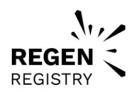
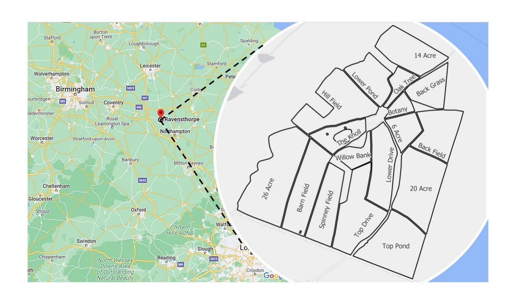
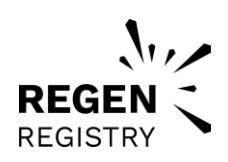
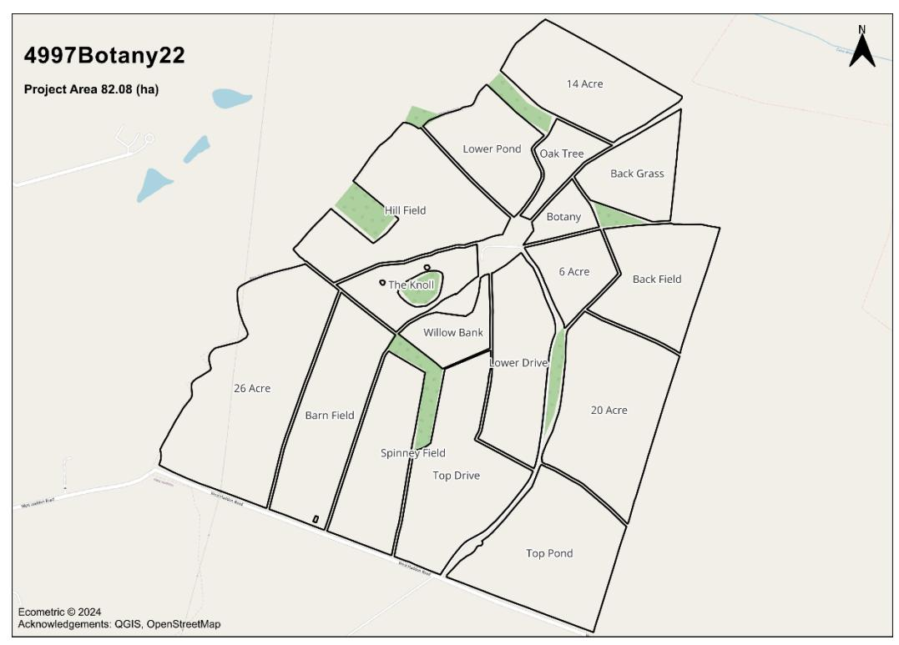
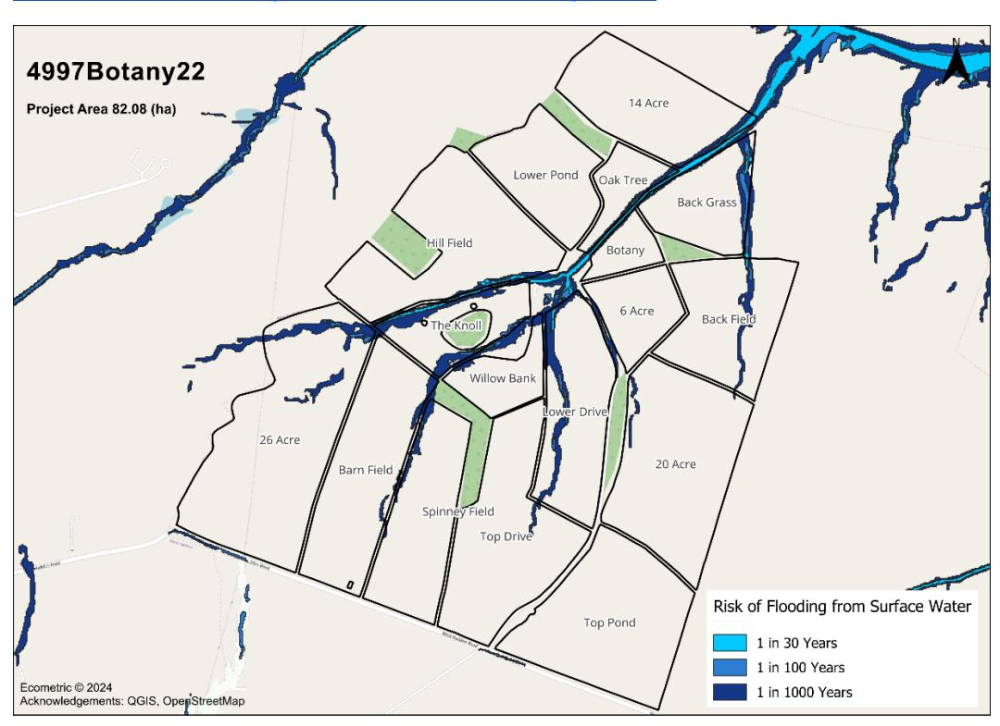

# Regen Registry

# Project Plan: 4497Botany22

### **Regen Network Development, PBC**

Version: 4 Document ID:

Last updated: 9 August 2023 [registry@regen.network](mailto:support-registry@regen.network) <https://www.regen.network/>

# **Table of Contents**

| Project [ | Details                                                         | 1  |
|-----------|-----------------------------------------------------------------|----|
| 1.1.      | General Information                                             | 1  |
| 1.2.      | Summary Description of the Project                              | 1  |
| 1.3.      | Credit Class and Methodology                                    | 3  |
| 1.4.      | Project Eligibility                                             | 3  |
| 1.5.      | Project Design                                                  | 4  |
| 1.6.      | Project Actors                                                  | 4  |
| 1.6.      | 1. Project Proponent                                            | 4  |
| 1.7.      | Project Ownership                                               | 4  |
| 1.8.      | Project Start Date                                              | 4  |
| 1.9.      | Project Crediting Period                                        | 5  |
| 1.10.     | Permanence Period                                               | 5  |
| 1.11.     | Project Location                                                | 5  |
| 1.12.     | Description of Project Activity                                 | 7  |
| 1.13.     | Conditions Prior to Project Initiation                          | 9  |
| 1.14.     | Compliance with Laws, Statutes, and Other Regulatory Frameworks | 10 |
| 1.15.     | Participation in Other GHG or Environmental Crediting Programs  | 10 |
| 1.16.     | Additional Information Relevant to the Project                  | 10 |
| 2. Safe   | eguards                                                         | 12 |
| 2.1.      | No Net Harm                                                     | 12 |
| 2.2.      | Local Stakeholder Consultation                                  | 12 |
| 2.3.      | Environmental Impact                                            | 13 |
| 2.4.      | Public Comment                                                  | 13 |
| 3. App    | lication of Credit Class and Methodology                        | 14 |
| 3.1.      | Applicability of Credit Class and Methodology                   | 14 |
| 3.2.      | Project Boundary                                                | 15 |
| 3.3.      | Baseline Scenario                                               | 17 |
| 3.4.      | Additionality                                                   | 18 |

| 3.5.   | Credit Class & Methodology Deviations               | 18 |
|--------|-----------------------------------------------------|----|
| 4. Qu  | antification of GHG Emission Reduction and Removals | 19 |
| 4.1.   | Baseline Emissions                                  | 19 |
| 4.2.   | Project Emissions                                   | 19 |
| 4.3.   | Leakage                                             | 19 |
| 4.4.   | Net GHG Emission Reductions and Removals            | 20 |
| 4.5.   | Risk Management                                     | 20 |
| 5. Mo  | onitoring                                           | 22 |
| 5.1.   | Data and Parameters Available at Registration       | 22 |
| 5.2.   | Data and Parameters Monitored                       | 23 |
| 5.3.   | Monitoring Plan                                     | 23 |
| Annend | lix                                                 | 27 |

# Project Details

### 1.1. General Information

| Project Name        | Botany Farm Partnership (4997Botany22) |
|---------------------|----------------------------------------|
| Version of Document | 2                                      |
| Date Submitted      | 31/03/2025                             |
| Prepared by         | Hannah Baldwin                         |
| Contact Information | hannah@ecometric.co.uk                 |

### 1.2. Summary Description of the Project

*Provide a summary description of the project to indicate the nature of the project and its implementation, including the following:*

- Project Methods Summary: The project involves changes in farming methods to reverse soil degradation, prevent water run-off, increase soil organic carbon stocks (SOCS), improve soil and business resilience and improve water quality. These changes are also being implemented to address chemically resistant weeds, pests and diseases and, over time, to reduce reliance on inorganic fertilisers and pesticides. Increases in SOCS are expected to improve soil workability, soil structure, drainage and water retention thereby reducing cultivation costs and improving crop yields.
- Location of the project: Northamptonshire, United Kingdom.
- Expected GHG removals: GHG removals will be achieved through the implementation of Regenerative Farming techniques to increase SOCS and reduce production GHG emissions. The project expects to achieve a net GHG removal per annum of 5-10 tCO2e per ha until soil saturation is achieved. (expected to take >20 years at the above removal rate, with achievable soil saturation point indicated by SOCS levels in adjacent permanent pastures). The primary indicator in this credit class is SOCS. Levels will be increased by growing harvestable and cover crops and grass to maximise canopy and root growth while incorporating crop residues and manures. Reduced soil disturbance, maintaining soil cover and returning crop residues will maximise retained organic matter (OM) in the soil and, through improved soil microbial activity, this will be converted to resilient SOC. Time-controlled, high-density grazing will increase pasture SOCS by maximising above and below-ground biomass production over the course

- of each growing season, while manure deposited will maintain a diverse and healthy soil microbiome.
- Practices Used: GHG reductions will be achieved from reduced cultivation, reduced whole farm use of inorganic fertiliser, particularly nitrogen fertiliser and increased use of renewable energy sources.
  - Building SOCS by implementing changes to crop rotations.
  - Retaining SOC by reducing cultivations. Direct drilling or minimum inversion tillage will be implemented to retain SOC in the soil. Deeper cultivations and ploughing will only be used strategically to relieve soil compaction and waterlogging and to incorporate crop residues and green and livestock manures, where absolutely necessary. All cultivations will be undertaken with the objective of increasing and then maintaining SOCS levels.
  - Where appropriate, the inclusion of grass, clover and mixed species leys in the rotation to increase SOCS through retained root and canopy growth, reduce reliance on inorganic fertilisers and pesticides and provide grazing for livestock.
  - Maintaining ground cover by including cover and catch crops in the rotation to increase crop diversity and assist in cultural weed control. Spring crops will be preceded by a cover crop and where possible winter crops preceded by a catch crop.
  - Implementing a diverse crop rotation to encourage an increase in soil biodiversity and reverse the buildup of soil-borne diseases and weeds.
  - Where appropriate to the farming system, implementing suitable livestock enterprises to utilise grass leys and cover crops, provide organic fertiliser and increase SOCS by high density, time-controlled grazing and residue grazing techniques.
- Prior Conditions: The farm was historically managed under an all arable, cropland, winter cropping regime using deep, inversion cultivation and intensive secondary cultivations. Only two or three crops were being grown each year. High levels of herbicides were being used in an attempt to control blackgrass. SOC was being lost leading to degraded soil structure, water run-off, loss of topsoil and localised waterlogging and failing blackgrass control. This decades-long cycle of SOCS depletion has been halted by cultural and practice changes, incentivised by a sustainability moral focus to protect soil with the possibility to access carbon revenue.
- Expected average removals: 5-10 tCO2e/ha/year.
- Expected Farm Enterprise GHG Production Emissions 3 tCO2e/ha/year.
- Expected tradable Climate Positive Surplus 2 8 tCO2e/ha/year.

### 1.3. Credit Class and Methodology

*Indicate the Credit Class and Methodology this project will employ, including the version of the document.*

#### Credit Class

| Credit Class Name    | GHG Benefits in Managed Crop and Grassland Systems Credit Class |
|----------------------|--------------------------------------------------------------------|
| Credit Class Version | 1.5.1                                                              |

#### Methodology

| Methodology Name    | Soil Organic Carbon Estimation in Regenerative Cropping & Managed Grassland Ecosystems Methodology |
|---------------------|----------------------------------------------------------------------------------------------------------------------|
| Methodology Version | 1.1                                                                                                                  |

### 1.4. Project Eligibility

*Describe and justify how the project meets the eligibility criteria outlined in the Credit Class and Methodology. This could include a description of geographic applicability, land eligibility criteria and prior land use, project activity, etc… Note that some eligibility criteria are listed as their own sections below.*

This project falls within the croplands, grasslands, pasturelands and shrublands ecosystem type classification, as defined in the RND Taxonomy. There has been no change of ecosystem type within the 5 years prior to project registration as evidenced by the 5-year historic management information appended to this document.

Project activity falls within regenerative crop management and managed grazing as approved by this Credit Class.

Land ownership/tenure has been demonstrated by adequate documentation / legal attestation by the Landowner / Land Steward as appended to this document.

Landowner / Land Steward have also attested to maintaining material regulatory compliance with adherence to all laws, regulations and other legally binding mandates relating to Project Activities.

The Crediting Term for this project is 10 years, with an option to renew. The permanence obligation of 10 years is additional to the Crediting Term.

### 1.5. Project Design

*Indicate whether this project is an individual project or aggregated project:* This project includes a single location and forms part of an aggregated project.

### 1.6. Project Actors

#### 1.6.1. Project Proponent

*Provide the contact information of the project proponent.*

| Organisation Name | Ecometric Ltd                                                               |
|-------------------|-----------------------------------------------------------------------------|
| Contact Person    | David Wright                                                                |
| Title             | Project Proponent, Project Developer, Project Monitor        |
| Address           | Fraser-Ross House, 24 Broad Street, Stamford, Lincolnshire, PE9 3JH. UK. |
| Email             | david@ecometric.co.uk                                                       |
| Telephone         | +44797 1469134                                                           |

### 1.7. Project Ownership

*Provide evidence of ownership of the land, including:*

- *Documentation and or attestation of land tenure or ownership.* The Project Area is 100% owned by the Project Owner, Nick Denman.
- *Indicate the intended distribution of credits issued to the project.* Issued Credits will be 100% owned by the Project Owner, Nick Denman.

### 1.8. Project Start Date

*Indicate and justify the project start date, specifying the day, month, and year.* 01/01/2022. The project will be aligned with the calendar year, with annual monitoring rounds taking place in the August – March bracket when the soil is dormant, and crop cover is low enough to allow vehicle-based soil corers to access without causing crop damage.

### 1.9. Project Crediting Period

*Indicate the crediting period, specifying the day, month, and year for the start and end dates and the total number of years.* 01/01/2022 to 31/12/2031.

### 1.10. Permanence Period

*Indicate the permanence period per the requirements stipulated in the Credit Class, specifying the day, month, and year for the start and end dates and the total number of years. If this section is not applicable, delete this text.*

The Credit Class requires a 10-year permanence period, checked by a year-10 monitoring round to identify reversals. The permanence period for this project is 01/01/2032 to 31/12/2041.

### 1.11. Project Location

*Indicate the project location and attach a GIS file specifying the geographic boundary of the project, delineating the project area boundary within a regional context. Project Proponents implementing an aggregated project must include location information for all enrolled sites.*

| Country                   | England, United Kingdom. |
|---------------------------|--------------------------|
| Region / State / Province | Northamptonshire.        |
| City / Town / Community   | Ravensthorpe.            |

#### Gross Project Area

*Indicate the gross project area (including all structures) in hectares).*

#### Habitat

*Specify vegetative habitat for project areas including protected, endangered or other species of particular value, major vegetation community types and/or major ecological communities.*

Cropland encompasses a variety of cereals, including spring wheat, winter barley, and winter wheat, along with both spring and winter linseed. Additionally, it includes grassland and areas managed under Countryside Stewardship. Permanent grasslands are characterised by mixed-species grass leys. Woodland areas contain both hardwood and softwood trees, while hedgerows are predominantly made up of blackthorn and hawthorn.

#### Environmental Conditions of Project Area

*Describe the climatic conditions of the project, including the hydrology and topography.*  The project is in the temperate Koppen-Geiger Climate Classification CFB with an annual average temperature of 11°C and an average annual rainfall of 700mm or 28 inches. The topography of Botany Farm is characterised by gently rolling hills and undulating terrain, situated at an elevation of approximately 120 meters above sea level.

#### Major Environmental Threats

*Indicate the major environmental threats to the project area in the last few years, including droughts, fires, floods, pests, etc…*

Flood risk for the project area is categorised as medium for Surface Water and very low for Rivers and the sea by the UK Government Lead Local Flood Authorities[: Your long term flood risk assessment -](https://check-long-term-flood-risk.service.gov.uk/risk) Check your long term flood risk - [GOV.UK \(check-long-term-flood-risk.service.gov.uk\).](https://check-long-term-flood-risk.service.gov.uk/risk)

### 1.12. Description of Project Activity

*Describe how the project activity or activities applied will achieve ecological outcomes including (if applicable) the net GHG emission reductions or removals. For all activities listed, include information on the planning and implementation of the activity including descriptions of how the different project stakeholders are involved.*

The project involves changes in farming methods to reverse soil degradation and water run-off, increase SOCS, improve soil and business resilience, and improve water quality. These changes are also being implemented to address increasing weed, pest and disease burdens and, over time, to reduce reliance on inorganic fertilisers and pesticides. Increases in SOCS are expected to improve soil workability, structure, drainage and water retention thereby reducing cultivation costs and improving crop yields.

SOCS levels will be increased by growing harvestable and cover crops and grass to maximise root and canopy growth while incorporating crop residues and manures. Reduced soil disturbance and maintaining soil cover will ensure that root growth is retained, and crop residues are returned to the soil and, through improved soil microbial activity, converted to resilient SOC. Where appropriate, time-controlled, high-density grazing will further increase SOCS by increasing root depth through season canopy growth and the deposited manure, improving the diversity of the soil biome and incorporation of organic matter into SOC.

Alongside these changes, the project is expected to deliver improved biodiversity and environmental benefits including dramatically increased bird and insect numbers.

Change strategy and implementation will be planned during quarterly Farm Management Meetings involving the following participants:

- Owner
- Land Agent
- Agronomist
- Project Developer: Annual contribution of Project Monitoring and Management data by ecometric.

[Technology —](https://www.ecometric.co.uk/technology) Ecometric

As part of the annual project reporting cycle, ecometric will deliver monitoring and management reports benchmarking SOCS change / GHG emissions / Nitrogen Use and Crop Yield across all projects to identify and share high-performer strategies in support of regenerative practice optimisation. The core focus of project data interpretation will be to establish the specific field-level management or environmental causes of SOCS change. This will influence a cycle of annual evidence-based change to maximise sequestration and minimise reversal risk.

#### Key changes:

- Building SOCS by implementing changes to crop rotations. This will be monitored In Accordance With (IAW) the approved methodology. Soil sampling will be carried out by approved 3rd party contractors and certified laboratories IAW the approved methodology. Monitoring reports will be presented annually to the Farm Management Team by ecometric to assist in data interpretation and support strategic decision-making.
- Retaining SOC by reducing cultivations. Direct drilling or zero inversion tillage will be implemented to retain SOC in the soil. Deeper cultivations and ploughing will only be used strategically to relieve soil compaction and waterlogging and to incorporate crop residues and green and livestock manures, where absolutely necessary. All cultivations will be undertaken

with the objective of increasing and then maintaining SOCS levels. The cultivation strategy will be set by the farm management team.

- The inclusion of grass, clover, and mixed species leys in the rotation to increase SOCS through retained root and canopy growth, reduce reliance on inorganic fertilisers and pesticides and maintain livestock enterprises. The rotation strategy will be set and implemented by the Farm Management Team.
- Maintaining ground cover by including cover and catch crops in the rotation will also increase crop diversity and assist in disease, pest and weed control. Where possible, Spring crops will always be preceded by a cover crop and Autumn crops by a catch crop. The rotation strategy will be set and implemented by the Farm Management Team.
- Implementing a diverse crop rotation to encourage an increase in soil biodiversity and reverse the buildup of soil-borne diseases and weeds. The rotation strategy will be set and implemented by the Farm Management Team.
- Implementing suitable livestock enterprises to utilise grass leys and cover crops, provide organic fertiliser and maximise the increase of SOCS by high density, time controlled and residue grazing techniques. The grazing strategy will be set and implemented by the Farm Management Team.

### 1.13. Conditions Prior to Project Initiation

*Describe the conditions prior to implementation of the project and demonstrate the project has not been implemented to generate GHG emissions then subsequently destroyed.*

The farm was historically managed under an all arable, winter cropping regime using deep, inversion cultivation and intensive secondary cultivations. Only two or three crops were being grown each year. High levels of herbicides were being used in an attempt to control blackgrass. SOC was being lost leading to degraded soil structure, water run-off, loss of topsoil and localized waterlogging and failing blackgrass control. This decades-long cycle of SOCS depletion has been halted by cultural and practice changes, incentivised by a sustainability and moral focus to protect soil with the possibility to access carbon revenue.

This Carbon Project will continue to play an important role of providing the data evidence of which specific practices provide SOC stock increase and which do not, to ensure a soil focus. Cropping, fertiliser and spray plans are set annually along with the integration of livestock to the arable land. Stocking rates and timings for the permanent pasture are planned to protect and improve soils. The financial incentive of carbon revenue will continue to support the continuation of regenerative practices and their constant improvement. Evidencing the specific

effects of annual management decisions and their implementation on SOCS, and how this relates to farm business and environmental performance, will ensure positive business, environmental and climate outcomes.

### 1.14. Compliance with Laws, Statutes, and Other Regulatory Frameworks

*Identify and demonstrate project compliance with any relevant local and national laws, statutes, and other regulatory frameworks.*

The Project will continue to comply with laws and rules laid down, published and periodically updated by the Department for Environment, Food & Rural Affairs (DEFRA), Environment Agency, Rural Payments Agency, Forestry Commission, Food Standards Agency, Health and Safety Executive and Animal and Plant Health Agency. Links to the rules and regulations relating to specific project area activities are provided in Appendix A.

## 1.15. Participation in Other GHG or Environmental Crediting Programs

*Indicate whether the project has been registered, or is seeking registration under any other GHG programs, biodiversity programs, or any other payment for ecosystem service crediting or certification programs. Where the project has been registered or attempted registration under any other GHG or ecological crediting program, provide the registration number and details and information of any rejections of the project application on other registries.*

This project has not been registered in any other GHG or environmental crediting programs.

### 1.16. Additional Information Relevant to the Project

Personal / Commercially Sensitive Information

*Indicate whether any commercially sensitive information should be excluded from the public version of this project plan. This information is restricted to the following Project Plan items:*

- *Entity name and contact information (for project actors other than the Project Proponent, Monitor, and Verifier).*
- *Underlying documents proving attestation of land tenure.*
- *Underlying contractual agreements between project actors.*

- Entity name and contact information (for project actors other than the Project Proponent, Monitor, and Verifier).
- Underlying documents proving attestation of land tenure.
- Underlying contractual agreements between project actors.

# 2. Safeguards

### 2.1. No Net Harm

*Detail any potential negative socio-economic and environmental impacts of the project and the steps taken to mitigate them. Include risks of project implementation to local stakeholders, how risks are mitigated and plans to protect local stakeholder property rights. Include a process for conflict resolution between project proponent and local stakeholders, such as grievance redress.*

The Project has been assessed for potential impacts on local employment to conclude that this project will not result in any reduction in labour requirements. Additionally, no negative environmental impacts have been identified. All property rights are held by the Project Proponent.

It's worth noting that there are no indigenous communities within the UK that would be affected by this project. Local stakeholders stand to benefit from environmental improvements, especially since they have rights of access to the area through public footpaths.

No potential sources of conflict or grievance have been identified. The project aims to enhance both the farming system and the surrounding semi-natural environment, without reducing the farm workforce.

The Landowner has 100% ownership of the Project Area. Owners and occupants of neighbouring residential properties have been consulted and have responded positively. Furthermore, all business employees and contractors have been consulted; they are positively impacted by the project and are supportive of its implementation.

### 2.2. Local Stakeholder Consultation

*Describe how local stakeholders, such as landowners or indigenous communities, were identified and consulted prior to the project implementation. Include methods for engagement such as meetings (including general dates), how local consultation outcomes were shared, how ongoing local stakeholder communication is handled and why local stakeholder input was included or not in project design.*

This carbon project originated from Landowner / Land Steward interest in the adoption and optimisation of regenerative agricultural practices and the potential to access carbon credit revenue for surpassing net zero to achieve a climatepositive SOC surplus. A measurement-based methodology was sought to monitor

the outcome of practice changes and ecometric was chosen as the provider, leading to the design and inception of this Project.

Landowners and Land Stewards, including all employee and contractor members of the Farm Management and Operations Teams were consulted and fully engaged in the planning of this project. Bringing this combined expertise to bear in support of project monitoring, reporting, data interpretation and management plan implementation, creates a singular focus on achieving agreed productivity, emissions reduction, and sequestration outcomes.

### 2.3. Environmental Impact

*Indicate if environmental impact assessments were undertaken and describe the process and findings.*

No negative environmental impacts were identified.

### 2.4. Public Comment

*Detail if a community public consultation was undertaken prior to the project implementation and detail how comments were addressed, either in updates to the project or justified as irrelevant.*

The Private Ownership of the Project Area negated the need for Public Consultation before initiating the project. Measures have however been taken in parallel to the Carbon Project to enhance biodiversity for environmental and public good including winter bird plots are used on less productive field corners, to provide for birds and supplement the woodland and hedgerow habitats on the farm. Pollen and nectar plots are used against water courses to prevent soil run-off and to provide habitat for pollinators and predatory species reducing the requirement for insecticides.

Under the Sustainable Farming Incentive, hedgerow management includes less frequent cutting to allow for more food for farm birds. Companion crops have been implemented in arable crops, to improve plant diversity, aid soil structure and try to maintain living roots after harvest. Legume Fallow is being used an arable break crop to improve soil structure, add organic matter and for blackgrass control. Finally, herbal leys will be used in field corners where historically compaction is an issue, to repair soil structure.

## 3. Application of Credit Class and Methodology

### 3.1. Applicability of Credit Class and Methodology

*Demonstrate and justify how the project activity(s) meet the applicability conditions of the Methodology, Credit Class, and tools (where applicable) applied to the project. Address each applicability condition separately.*

#### General Information

The project will be managed according to the approved methodology detailed in the Credit Class-GHG Benefits in Managed Crop and Grassland Systems developed by Ecometric. The key objective and indicator of success in this project is SOCS increases by sequestration of atmospheric CO2 into the soils, which will be achieved through the implementation of regenerative farming techniques. Increases in SOCS will be measured annually using Ecometric's approved methodology. Farm enterprise GHG emissions will also be accounted for each year IAW with the Methodology, to calculate a net creditable carbon change.

#### Ecosystem Type Classification

All field parcels within the project area fall within Regen Network Taxonomy, Ecosystem Type, Cropland or Pastureland/Hay.

#### Geographic Bioregion

The Project Area falls within the Koppen-Geiger Climate Classification CFB Warm Temperate / Fully Humid / Warm Summer.

#### Prior Land Use Eligibility

Historic management plans reported in Appendix A show no change in land use or ecosystem type in the previous 5 years prior to the project start date. This meets the Conditions for Applicability of the Credit Class.

#### Project Activity

Project Activity falls within the approved regenerative crop management activity as defined by the Credit Class. This includes reduced tillage, crop rotation, cover cropping, residue harvest, intercropping, rotational grazing, and nutrient management IAW Regen Network Taxonomy- Best Management Practice Tab.

### 3.2. Project Boundary

*Define the project boundary and identify the relevant GHG sources, sinks, reservoirs, or other ecological indicators for the project.*

| Baseline GHG sources, sinks and reservoirs                                | Gasses(CO2, CH4, NO2) | Explanation                                                                                                                                                                                                                                                                                                                                                                                        |
|------------------------------------------------------------------------------|--------------------------|----------------------------------------------------------------------------------------------------------------------------------------------------------------------------------------------------------------------------------------------------------------------------------------------------------------------------------------------------------------------------------------------------|
| Soil - Reservoir and Sink                                                 | CO2                      | Soil is the largest terrestrial reservoir of carbon in the form of SOC (converted to CO2e for equivalence to GHG emissions). In this regenerative agriculture system, soil also serves as a sink in absorbing more CO2 than is emitted by the crop (food and fibre) production cycle. This has been evidenced by a climate-positive SOC surplus.      |
| Above-ground Biomass - Hedgerows and Woodland as Reservoir and Sink | CO2                      | Although not considered in the calculation of the Project area carbon balance which is limited to the evaluation of Soil, hedgerows and woodland within the project area are significant carbon sinks. These areas are however excluded from the carbon balance calculation by geographic masking to limit the evaluated area to cropped field areas. |

| GHG Sources - Agricultural food and fibre production | CO2, CH4, NO2 | These sources are quantified during the monitoring cycle using the IPCC Tier 2 GHG Emissions Calculators listed in Appendix A, which are reported on the negative side of the carbon balance as GHG emissions. Net Carbon Balance is calculated by deducting total GHG Emissions from SOC stock change over the same monitoring interval IAW the Methodology and Ecocredits are only issued for climate |
|------------------------------------------------------------|---------------|---------------------------------------------------------------------------------------------------------------------------------------------------------------------------------------------------------------------------------------------------------------------------------------------------------------------------------------------------------------------------------------------------------------------------------------------------------------|
|                                                            |               | positive surplus tCO2e.                                                                                                                                                                                                                                                                                                                                                                                                                                       |

### 3.3. Baseline Scenario

*Identify and justify the baseline scenario in accordance with the procedures outlined in the Methodology. Explain and justify key assumptions and rationale for the application of the applied methodology and provide any relevant references.*

The Methodology Baseline is defined as the total carbon stocks calculated at the Project's Initial Monitoring Date (IMD), or the date of the first monitoring round. The methodology will use a static baseline. All monitoring rounds after IMD will be compared to the baseline to calculate the creditable carbon change.

Baseline soil sampling, laboratory and Artificial Neural Network (ANN) AI analysis were carried out in February 2023. AI training and testing methodology will be detailed in each Monitoring Report. Compact geographic stratification (CGS) will be used as the primary stratification method but stratified random may also be used. 10 cores will be gathered in each CGS stratum and aggregated (composited) into a single sample per stratum for laboratory analysis. The laboratory SOCS results are used as the response data to train the AI, with Sentinel-2 multispectral pixel values used as the predictor data. Sample locations on each sampling round will be specifically selected to cover a representative subsample of all crop types within the rotation, to ensure sampling is indicative of the whole project area and AI training data is a complete reflection of the farming system. Dividing the project area into subsamples also reduces overall cost, while still representing the whole project area to allow the AI to correlate multispectral predictor pixel values to SOCS laboratory result response values for each crop type present. Each consecutive sampling round will include some subsample locations of the previous round. Net Field SOC will be reported for all fields included within the geographic boundaries of the Project Area on each monitoring round.

SOC Baseline Stock February 2023: 6,251.40 tSOC.

Project Area Baseline GHG Emissions were independently calculated for all food and fibre production within the Project Area, emitted over the Year 1 Monitoring Period, using the Farm Carbon Toolkit IPCC Tier 2 compliant calculator.

GHG Emissions: -121.90 tCO2e.

### 3.4. Additionality

*Demonstrate the additionality of the project in accordance with the Credit Class and Methodology and any relevant tools taking into account that project activities must not be mandated by any law, statute, or other regulatory framework.*

The Credit Class specified additionality tests have all been met:

- 1. Project activities are not legally required practices.
- 2. MRV demonstrates carbon storage above business as usual.
- 3. There is a reasonable expectation for carbon dioxide drawdown from project activity.
- 4. Credits are only issued for carbon removed from the atmosphere and quantified through this approved methodology after the initiation of baseline soil testing.

Project activities are not DEFRA legally required practices.

Annual MRV will report measured SOCS increases to evidence gains > BaU associated with the implementation, continuation and optimisation of regenerative farming and managed grazing techniques.

Arable and temporary grassland SOCS levels have been compared against permanent pasture SOCS levels to indicate semi-managed saturation levels and time to reach saturation.

Whole enterprise GHG emissions will be calculated for each monitoring round and deducted from any SOCS gains after the initiation of the February 2023 Baseline, to ensure that tradable surpluses are climate positive.

### 3.5. Credit Class & Methodology Deviations

*Describe and justify any deviations from the Credit Class, Methodology, or Regen Registry Program Guide, and indicate that the deviation will not negatively impact the conservativeness of the quantification of GHG emission reduction or removals.* None.

# 4. Quantification of GHG Emission Reduction and Removals

### 4.1. Baseline Emissions

*Describe the process for the quantification of baseline emissions and/or removals in accordance with the Methodology. Include all relevant equations and explain and justify all relevant choices with respect to the selection of emission factors and default values.*

Farm enterprise Baseline GHG emissions were calculated using the IPCC calculators listed in Appendix A, as reported in Paragraph 3.3

### 4.2. Project Emissions

*Describe the quantification approach for emissions and removals according to Approved Methodology and Credit Class, including equations and justifications of choices made.*

Farm enterprise GHG emissions will be calculated for each monitoring period using the IPCC calculators listed in Appendix A. Removals will be calculated IAW the approved methodology by deducting baseline SOCS from the current monitoring round SOCS. Net carbon balance will be calculated by deducting total farm enterprise GHG emissions within the project area geographic boundary [tCO2e] from total SOCS change over the same monitoring interval [tCO2e].

### 4.3. Leakage

*Describe the procedure and quantification of leakage emissions in accordance with the approved Methodology and Credit Class, including all equations and justification of choices made.*

Project Activity Leakage is considered to be de minimis in this project. Yield reduction leakage of >10% will be monitored by comparison to a rolling 5-year average crop yield reported for each crop type within the rotation. Average project area yields are to remain within 10% of stated yield averages for the 5 years preceding baseline IAW the Credit Class.

### 4.4. Net GHG Emission Reductions and Removals

*Identify project-relevant GHG sources, sinks and reservoirs for project and baseline, including leakage. Include relevant explanations for each.*

| Year | Estimated baseline emissions (tCO2e) | Estimated project removals (tCO2e) | Estimated leakage emissions (tCO2e) | Estimated net GHG emissions reductions or removals (tCO2e) |
|------|-----------------------------------------------|---------------------------------------------|----------------------------------------------|---------------------------------------------------------------------------|
| 2022 | 246                                           | 616                                         | De Minimis                                   | 370                                                                       |

Through the implementation of Regenerative Farming techniques to increase SOCS. The project expects to achieve a net GHG removal per annum of 7-10 tCO2e per ha until soil saturation is achieved (at current annual rates of SOCS change it would take >26 years for cropland soils to reach equivalent SOCS levels recorded in permanent pasture field parcels adjacent to the project area with equivalent soil type).

- Expected average removals: 5-10 tCO2e/ha/year.
- Expected Farm Enterprise GHG Production Emissions 3 tCO2e/ha/year.
- Expected tradable Climate Positive Surplus 2 8 tCO2e/ha/year.

### 4.5. Risk Management

*Indicate the contributions this project will allocate to buffer pools stipulated in the Credit Class and indicate whether the project offsets face any risk of reversal by identifying any risks that may substantially affect the project's GHG emission reductions or removals.*

SOCS will be annually monitored during the 10-year Project Term to allow further changes to farming practices to correct any short-term reversals. This will drive evidence-based practice change to protect against future reversals. Residual risk of extreme weather or management error-related reversals will be quantified by a monitoring round at the end of the Project Term (Year 10). The results of the Project Term monitoring round will be used to allocate the first 50% of the cumulative buffer pool and a final permanence monitoring round in Year 20, 10 years after the Project Term ends, will be used to determine the allocation of the final 50% of the cumulative buffer pool. Measured reversals will be compensated by buffer pool credit retirements IAW the Credit Class.

#### Buffer Pools

*Indicate the contributions this project will allocate to buffer pools stipulated in the Credit Class and indicate whether the project offsets face any risk of reversal by identifying any risks that may substantially affect the project's GHG emission reductions or removals.*

A buffer pool contribution of 20% of each credit issuance (as quantified by the latest monitoring report) is required for this credit class, with 10% allocated to the Crediting Term Buffer Pool and 10% to the Permanence Reversal Buffer Pool. The Crediting Term Buffer Pool will be allocated at the end of the Crediting Term (10 years after project initiation) and the Permanence Reversal Buffer Pool at the end of the Permanence Period (20 years after project initiation). The allocation of the buffer pools will be determined by a monitoring round and report, to quantify project area SOC stock 10 and 20 years respectively after the project adoption date. Each report will be subject to verification and buffer pool credits only released to the Project Proponent for distribution to the Landowner, if the Project Area Net SOC total is equal to or greater than the Project Area Net SOC total recorded in the final credit vintage monitoring report.

If the reversal exceeds the buffer, then additional compensation will be achieved by:

- Renewing the project and utilising further issuances to compensate the remaining reversal or,
- Using any non-transacted credits to compensate or,
- Purchase of credits to compensate.

# 5. Monitoring

### 5.1. Data and Parameters Available at Registration

*Indicate the data and parameters available at registration, and remain fixed throughout the project crediting period. Copy and paste the table as necessary for each data/parameter.*

| Data Indicator                                                                                     | Soil Organic Carbon Stock (SOCS)                                                                             |
|----------------------------------------------------------------------------------------------------|--------------------------------------------------------------------------------------------------------------|
| Data unit                                                                                          | tCO2e                                                                                                        |
| Description                                                                                        | Baseline Farm Enterprise GHG emissions. Baseline Project Area SOCS.                                       |
| Source of data                                                                                     | GHG Emissions digital calculators are listed in Appendix A. SOCS ecometric Baseline Monitoring Report. |
| Value applied                                                                                      | Net Carbon Balance tCO2e                                                                                     |
| Justification of choice of data or description of measurement methods and procedures applied | IAW with approved Methodology and Credit Class                                                            |
| Purpose of Data                                                                                    | Determination of baseline GHG emissions and SOC Stocks                                                    |

### 5.2. Data and Parameters Monitored

*Indicate all data and parameters that will be monitored during the project crediting period. Copy and paste the table as necessary for each data/parameter.* 

| Data Indicator                                                                                     | Soil Organic Carbon Stock (SOCS)                                                                                  |
|----------------------------------------------------------------------------------------------------|-------------------------------------------------------------------------------------------------------------------|
| Data unit                                                                                          | tCO2e                                                                                                             |
| Description                                                                                        | GHG Emissions / SOCS change                                                                                       |
| Source of data                                                                                     | Farm Management records, soil sample laboratory analysis of SOC and Bulk Density                            |
| Value applied                                                                                      | Values will be reported in the Monitoring Report.                                                           |
| Justification of choice of data or description of measurement methods and procedures applied | IAW approved Methodology.                                                                                         |
| Purpose of Data                                                                                    | Establish Project Area Carbon Balance (Monitoring Interval SOCS Change – Monitoring Interval GHG Emissions) |

### 5.3. Monitoring Plan

*Describe the process and scheduling for obtaining, recording, and analysing monitored data and parameters set out in 5.2. Include details on the methods used for measuring, recording, storing, aggregating, and creating monitoring reports, including monitoring equipment where applicable. Additionally, describe the personnel responsible for carrying out monitoring activities, the policies for oversight and accountability of monitoring activities, and the procedures for internal auditing and quality assurance.*

Monitoring and Reporting will be undertaken by Ecometric as Project Monitor and Project Proponent.

The methodology gathers physical soil sample data over subsections of project areas and uses the laboratory-tested SOCS values to train an Artificial Neural Network (ANN) AI system to correlate SOCS with multispectral imagery 12-band pixel values. The trained AI estimates SOCS for each 10m2 pixel and reports the total SOCS for each field parcel and total project area. AI estimates are compared with all soil sample results to quantify and report estimation accuracy.

This Measure-and-Remeasure protocol gathers physical soil samples for laboratory analysis on every monitoring round to optimise AI training and quantify comparative performance.

#### Sampling Method

Soil samples will be gathered over a subsample of the Project Area on every monitoring round up to 100% coverage of the Project Area. Where the subsample field selection is <100% of the Project Area, field selection is designed to sample a reliable and statistically valid representation of the total population, including but not limited to, sampling all crop types grown within the project area. Sampling all representative crop types within the Project Area ensures the AI training data represents the whole rotation.

Rural Payment Agency (RPA) field boundaries will be buffered by 2 metres to contract field size to the cropped area and manmade structures will also be masked to remove from the project area.

**Sampling stratification design**: Compact Geographical Stratification (CGS) will be chosen as the primary sampling design as there is no prior knowledge of carbon distribution and this ensures an unbiased approach, but a stratified random design may also be used. The sample density will be determined by soil type variation, field size and field shape, with the field divided into strata of equal size to avoid individual sample results causing bias. The reported sample result will be the average SOCS for each individual stratum, determined by taking 10 cores in a grid pattern within each stratum and conflating them into a single sample for that stratum. The use of CGS and equal size strata ensures that the average SOCS per stratum does not bias the total SOCS value for each field. Stratification (CGS) sampling design will be reported in map form in the monitoring report.

**Core design, numbers and depth**: 10 soil cores will be taken in an equally spaced grid pattern within each stratum to a depth of 0-30cm, and conflated into a single sample per stratum for laboratory analysis.

**Assigning sample locations**: The soil sample locations will be pre-planned before sampling commences, using QGIS tools to divide each sampled field into equal-sized polygons and to plot 10 core locations within each polygon. This sampling plan will be saved as Shapefiles and uploaded into the sample team's control system. Each sample stratum will be assigned a unique label so that the location can be correlated with the data returned by the laboratory. The location of each core will be recorded by the sample team using GNSS with a minimum accuracy of +/- 4 metres.

**Soil sampling contractor and equipment**: Will be reported on each monitoring report.

**GPS system**: This will be reported on each monitoring report. Core positions will be reported in WGS84, EPSG:4326 geographical coordinates. Core positions will be gathered within 2m of the sampling plan locations.

**Sampling date:** This will be reported on each monitoring report.

#### Laboratory Analysis

Laboratory analysis will be conducted by a laboratory meeting BS EN ISO/IEC 17025, the British, European, and international standards for analytical laboratories. United Kingdom Accreditation Service (UKAS) inspects and accredits laboratories that wish to claim compliance with this standard. A laboratory that has been accredited by UKAS to ISO 17025 is permitted to display a Royal Crown Mark.

To give a complete audit of the carbon contained within the soil sampled, the following analysis and calculations will be conducted; Organic Carbon Stock (t/ha), Soil Organic Carbon (SOC %), Organic Matter (%), Total Nitrogen (%), Total Carbon (%), Carbon:Nitrogen Ratio, Soil Inorganic Carbon (SIC %) and Carbonate Class and Bulk Density (kg/l). Stone Fraction analysis will be tested where appropriate to soil type.

The soil sample data will be reported by the laboratory named in the monitoring report using DUMAS and measured Bulk Density tests.

**Accuracy**: Laboratory accuracy will be reported in each monitoring report along with any applied error deductions.

### AI Training

The ecometric AI System requires predictors and responses to train. The predictors will be the pixel values from multispectral satellite imagery and the responses will be SOCS values reported by the laboratory.

The sampling plan will allocate a laboratory SOCS value to each CGS stratum, representing an average SOCS for the stratum. The average SOCS value will then be allocated to each core location within the relevant stratum. A QGIS tool will be used to extract spectral values at each core location for all bands used in the analysis. The predictors and responses will be correlated by location to create the AI training dataset.

The AI will be trained on coincident pixel values and soil sample results, learning to correlate predictors and responses over the entire Project Area. A percentage of the training data is automatically partitioned by the AI and used during the training cycle for validation and testing. The trained AI uses the original multispectral satellite image to estimate SOCS values for every 10m2 pixel within the project area digital field boundaries, without reference to soil sample results. The AI estimated SOCS values [tSOC/ha] will be exported as the raster map shown in Figure 2.

#### AI Accuracy

On completion of the AI estimation, a QGIS tool will be used to calculate the AI estimate of the mean SOCS for each soil sampled stratum to allow a direct comparison to be made between AI estimated SOCS and coincident stratum soil sample SOCS. This comparison will be made across all sampled strata, to calculate and report an overall Mean Absolute Percentage Error (MAPE). This figure is an average absolute difference rather than an error but will be treated as a potential overestimation and deducted in full.

The AI SOCS values for the project area will be reported numerically and in map form. The MAPE % and the laboratory error will be deducted from the gross SOCS to calculate net AI SOCS. Field SOCS totals will be calculated by averaging the pixel SOCS values within the shapefile boundary and multiplying by the field area [Ha].

### GHG emissions monitoring

The estimation of GHG emissions will be carried out by the independent 3rd party expert contractor, Cross Compliance Solutions (CXCS), a DEFRA-approved Agricultural Auditor, using the Farm Carbon Toolkit IPCC Tier 2 calculator as defined in Appendix A. CXCS are responsible for all GHG emissions data gathering directly from the farm management team and carry out all emissions calculator data entry to ensure consistency, accuracy and independence. This calculation process appropriately accounts for all Scope 1,2 and 3 GHG sources emitted from the production of all food and fibre during the cropping season coinciding with the monitoring interval.

Input data and output reports are securely recorded in the Ecometric Sharepoint Document Handling system pending upload to the RND Document Handling System and Registry.

Verification will be dictated by RND and undertaken by an independent verifier chosen by the project proponent and approved by RND.

# Appendix

### GHG Emissions Calculation

Whole Farm Enterprise emissions will be calculated for all food and fibre production within the Project Area geographic boundaries using the most appropriate of the following three tools to farm enterprise activities:

[The Farm Carbon Calculator \(farmcarbontoolkit.org.uk\)](https://calculator.farmcarbontoolkit.org.uk/) [Cool Farm Tool | An online greenhouse gas, water, and biodiversity calculator](https://coolfarmtool.org/) [Farm carbon calculator | Home | Agrecalc](https://www.agrecalc.com/)

### Rules and Regulations Relating to Activities Carried Out Within the Project Area.

| Rule                                                | Link (if available)                                                                 |
|-----------------------------------------------------|-------------------------------------------------------------------------------------|
| Keeping livestock in England, Scotland and Wales | Keeping cattle, bison and buffalo in England and Wales - GOV.UK (www.gov.uk). |
|                                                     | Keeping sheep and goats in England - GOV.UK (www.gov.uk)                         |
|                                                     | Keeping pigs in England - GOV.UK (www.gov.uk)                                 |
| Protecting animal health and                        | Protecting the public from cattle kept on land.                                     |
| welfare                                             | Protecting animal welfare on farm and in transport.                              |
|                                                     | Producing safe-to-eat food for humans or animals.                                |
|                                                     | Reporting notifiable diseases in animals.                                           |
|                                                     | Bovine TB: testing cattle.                                                          |

|                                                     | Being responsible for the use of animal medicines on the farm.                                                    |
|-----------------------------------------------------|----------------------------------------------------------------------------------------------------------------------|
| Protecting the environment if you keep livestock | Pigs and poultry intensive farming: environmental permits.                                                        |
|                                                     | Making sure animal activities do not damage soil.                                                                 |
|                                                     | Storing organic manures in nitrate vulnerable zone.                                                               |
|                                                     | Storing slurry, silage and agricultural fuel oil safely.                                                          |
|                                                     | Fallen stock and safe disposal of dead animals.                                                                   |
|                                                     | Manage farming and horticultural activities to prevent soil erosion and water pollution.                          |
| Managing land that you own or occupy             | Public rights of way: landowner responsibilities.                                                                 |
|                                                     | Open access land: management, rights and responsibilities.                                                        |
|                                                     | Sites of special scientific interest: managing sites you own or occupy.                                           |
|                                                     | Heather and grass burning: rules and when you need a licence.                                                     |
|                                                     | Changing or improving rural land: check if there is a need to apply for an Environmental Impact Assessment. |

| Using pest control products       | Register as a professional user of plant protection products. Use, transport or store pesticides safely. Code of practice for using plant protection products: what you legally have to do.                                                                                                                                         |
|-----------------------------------|-------------------------------------------------------------------------------------------------------------------------------------------------------------------------------------------------------------------------------------------------------------------------------------------------------------------------------------------------|
| Applying products to your land    | Plan your use of fertiliser or manure to reduce water pollution. Adhere to Nitrate vulnerable zones: rules when you use fertilisers or store manure. Using sewage sludge on your land. Waste exemption: spread waste to benefit your land. Burning crop residues: restrictions and rules for farmers and land managers. |
| Produce plant varieties and seeds | Plant breeder's rights: national listing of plant varieties, seed certification and farm-saved seed                                                                                                                                                                                                                                    |
| Protecting landscape features     | What you must know before you start work on hedges or sites that are legally protected because of their historical importance: https://www.gov.uk/guidance/countryside hedgerows-regulation-and management#check-if-a-hedgerow-is protected. Hedgerows: find out if you can remove or carry out work.                   |

|                                 | Getting permission before you work on scheduled monuments.                                                                                                                                                                                                                                               |
|---------------------------------|-------------------------------------------------------------------------------------------------------------------------------------------------------------------------------------------------------------------------------------------------------------------------------------------------------------|
| Managing Trees and Woodland     | Tree planting and woodland creation: overview. Tree felling overview.                                                                                                                                                                                                                                 |
|                                 | Tree pests and diseases. Planning woodland projects: check if you need to apply for an Environmental Impact Assessment.                                                                                                                                                                            |
| Managing water                  | What you can do around watercourses and what permissions you need. https://www.gov.uk/guidance/owning-a watercourse#get-permission. Maintaining watercourses and understanding permissions you need to work around them. Checking if you need a licence to abstract water.             |
| Managing and disposing of waste | What you must do with hazardous waste, such as chemical containers and sheep dip. https://www.gov.uk/guidance/manage-waste on-land-guidance-for-land-managers. Managing waste on land: guidance for land managers. Discharges to surface water and groundwater: environmental permits. |

|                                                                 | Sheep dip: groundwater protection code.                                        |
|-----------------------------------------------------------------|--------------------------------------------------------------------------------|
| Importing, exporting, or distributing animals and food | What you must know if you import or export live animals or animal products. |
|                                                                 | Importing live animals or animal products.                                     |
|                                                                 | Exporting live animals or animal products.                                     |
|                                                                 | Exporting or moving animal feed or pet food.                                   |
|                                                                 | Exporting or moving food, drink and agricultural products.                  |
| Health and Safety                                               | Complying with all current health and safety legislation.                   |
|                                                                 | Farm health and safety - GOV.UK (www.gov.uk).                            |

### Sustainable Development Goals

- Goal 2: Zero Hunger, promoting sustainable food security and production, reducing water, and genetic resources.
- Goal 3: Good health and well-being. Produce high-nutrient-based food, clean air, positive work environment for employees.
- Goal 4: Quality education. Promote benefits of sustainable food production to broader the community and industry.
- Goal 6: Clean water and sanitation. Promote and support health ecosystem services.
- Goal 8: Decent work and economic growth. Potential to grow through increased employment, and diversified income providing great growth opportunities.
- Goal 13: Climate action. Mitigate climate impacts by utilising BMP to maintain the security of on-farm assets. Promote carbon farming activities as a solution to addressing and mitigating climate impacts.

### Co-Benefits

Co-benefits are not currently considered by this approved credit class but will be introduced when the formal co-benefit measurement system has completed its development and test and been added to the credit class.

### Land Ownership

The Project Area is 100% owned by the Landowner.