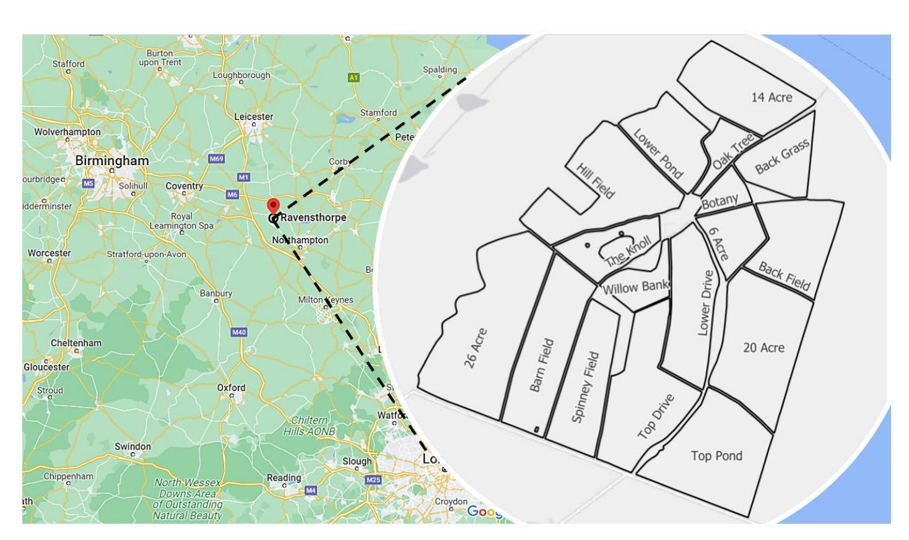
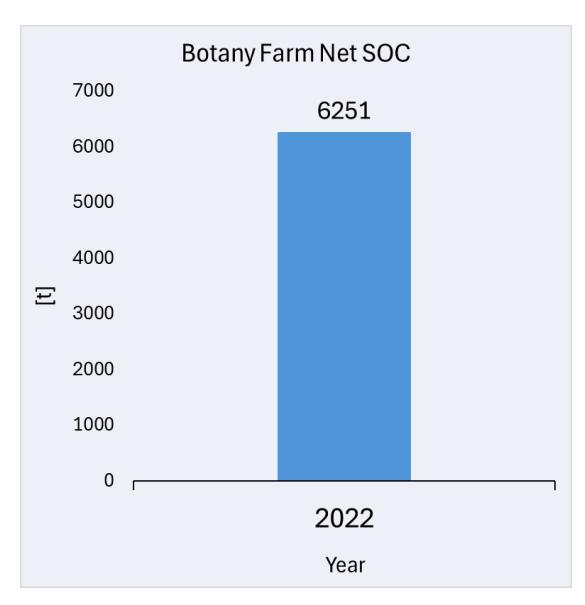
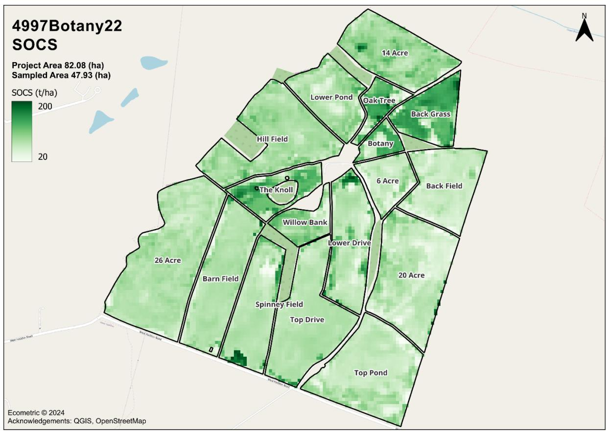

# **Soil Organic Carbon Project Report**

Baseline Report

**2022**

# **BOTANY FARM PARTNERSHIP**

Date Reported: 20/11/2024

Project Location

# **Executive Summary**

| Carbon Balance (tCO2e)1                |                     |  |  |
|----------------------------------------|---------------------|--|--|
| SOC Sequestered Intentionally Blank |                     |  |  |
| GHG Emissions                          | Intentionally Blank |  |  |
| Balance2                               | Intentionally Blank |  |  |

| Credit Statement                      |                     |  |  |  |
|---------------------------------------|---------------------|--|--|--|
| Permanence Buffer Credit Contribution | Intentionally Blank |  |  |  |
| Credits Pending Issue                 | Intentionally Blank |  |  |  |
| Total                                 | Intentionally Blank |  |  |  |

**SOC Change**

| Project Outline         |            |          |  |  |
|-------------------------|------------|----------|--|--|
| Total Project Area      | 82.08      | (ha)     |  |  |
| Total Sampled Area      | 47.93      | (ha)     |  |  |
| Field Boundaries        | RPA        |          |  |  |
| Soil Sampling Start     | 06/02/2023 |          |  |  |
| Soil Sampling Finish | 06/02/2023 |          |  |  |
| No of Samples           | 48         |          |  |  |
| Laboratory Analysis     | NRM        |          |  |  |
| MAPE                    | 7.10       | (%)      |  |  |
| Net SOC                 | 6251.40    | (tonnes) |  |  |
| SOC Change              | 0          | (tonnes) |  |  |

1 Not applicable if this is a baseline report.

i

2 Balance = SOC Sequestered – GHG Emissions

*Figure 1 - Project SOCS*

*Figure 2 - Monitoring Period Net SOCS Change[3](#page-2-0)*

3 Not applicable if this is a baseline report.

# Contents

| Project Information                  |     |
|--------------------------------------|-----|
| Results                              | 2   |
| Carbon Balance                       |     |
| Sampling Method                      |     |
| Laboratory Analysis                  | A-1 |
| SOCS Calculation                     | A-1 |
| Al Processing                        | A-2 |
| Accuracy                             | A-2 |
| Greenhouse Gas Emissions Monitoring  | A-2 |
| Monitored Impact Information         | A-2 |
| Carbon Balance                       |     |
| Accredited Ecometric Credit Class:   | B-1 |
| GHG Emissions Calculation            | B-1 |
| Regen Network                        | B-1 |
| Regen Registry                       | B-1 |
| Regen Marketplace                    | B-1 |
| Regen Ledger                         | B-1 |
| Ecometric Roles and Responsibilities | B-1 |
| Definitions - Regen Registry         | B-1 |
| Verifier                             | B-1 |

# List of Tables

| Table 1: SOC Results                           | 2 |
|---------------------------------------------------|---|
| Table 2: Carbon Balance                        | 4 |
| Table 3: Emissions Report Files                   | 4 |
|                                                   |   |
| List of Figures                                   |   |
| Figure 1 - Project SOCS ii                  |   |
| Figure 2 - Monitoring Period Net SOCS Changeii |   |
| Figure 3 - SOC Results Map                  | 3 |

# List of Terms

## **Soil Organic Carbon**

Soil Organic Carbon (SOC) is the organic carbon component of the total carbon content of soil.

## **Soil Organic Carbon Stock**

Soil Organic Carbon Stock (SOCS) is the amount of SOC contained within a defined area, normally measured as tonnes per hectare (t/ha).

### **Carbon Dioxide Equivalent**

To allow comparison between different emissions relevant to climate change, SOC is converted to Carbon Dioxide Equivalent (CO2e) by multiplying by the molecular weight of carbon dioxide (3.67).

#### **Carbon Balance**

Carbon Balance is also known as carbon footprint, it is calculated by deducting total farm enterprise Greenhouse Gas (GHG) Emissions from the SOCS change, over the monitoring period. A positive balance indicates that more CO2e has been added to the soil within the project area than has been emitted by the food and fibre production within the project area during the monitoring period.

#### **Mean Absolute Percentage Error**

Mean Absolute Percentage Error (MAPE) is defined as the mean of the absolute difference between the sampled (SOCS(S)) and AI (SOCS(AI)) as a percentage:

$$MAPE = \frac{1}{n} \sum_{t=1}^{n} \left| \frac{SOCS(S)_t - SOCS(AI)_t}{SOCS(S)_t} \right|$$
 (1)

# **Project Information**

Organisation Name: **Ecometric Ltd**

Project Name: **4997Botany22**

Monitoring Year: **2022**

Project Proponent and Monitoring Provider: **Ecometric Ltd**

Contact: [David Wright](mailto:David@ecometric.co.uk) / [Hannah Baldwin](mailto:hannah@ecometric.co.uk)

Crediting Term Period (Start + 10 Years): **01/01/2022 – 31/12/2031** Project Location: **52.333341, -1.038153 (WGS 84, EPSG:4326).**

Applied methodology: *Soil Organic Carbon Estimation in Regenerative Cropping and* 

*Managed Grassland Ecosystems*

Credit Class: *GHG Benefits in Managed Crop and Grassland Systems*

Project Status: Active

Project Filename: **4997Botany22 Soil Organic Carbon Project Report**

Signature:

David Wright BSc

Ecometric

CEO

# **Results**

The SOC results, for the project, are shown in [Table 1](#page-6-1) and [Figure 3.](#page-7-0)

*Table 1: SOC Results*

| Project Area AI SOC |                   |       |               |             |                | MAPE         | 7.10             |
|---------------------|-------------------|-------|---------------|-------------|----------------|--------------|------------------|
| Field               | Crop              | Area  | Gross Mean | Net Mean | Gross Total | Net Total | Stone Content |
|                     | Type              | [ha]  | [t/ha]        | [t/ha]      | [t]            | [t]          | [%]              |
| 14 Acre             | Winter Linseed    | 5.29  | 92.42         | 85.86       | 488.93         | 454.20       | 0.00%            |
| 20 Acre             | Winter Wheat      | 7.83  | 68.51         | 63.65       | 536.13         | 498.05       | 0.00%            |
| 26 Acre             | Winter Linseed    | 10.36 | 77.68         | 72.16       | 804.91         | 747.74       | 0.00%            |
| 6 Acre              | Winter Wheat      | 2.28  | 64.98         | 60.36       | 147.95         | 137.44       | 0.00%            |
| Back Field          | Winter Wheat      | 4.89  | 63.58         | 59.07       | 310.99         | 288.90       | 0.00%            |
| Back Grass          | Permanent Pasture | 3.20  | 129.27        | 120.08      | 413.00         | 383.67       | 0.00%            |
| Barn Field          | Spring Wheat      | 6.26  | 77.98         | 72.44       | 487.87         | 453.22       | 0.00%            |
| Botany              | Permanent Pasture | 1.11  | 107.44        | 99.81       | 119.15         | 110.69       | 0.00%            |
| Hill Field          | Winter Linseed    | 7.15  | 86.40         | 80.27       | 618.13         | 574.22       | 0.00%            |
| Lower Drive         | Spring Wheat      | 4.97  | 82.64         | 76.77       | 410.32         | 381.17       | 0.00%            |
| Lower Pond          | Winter Linseed    | 3.78  | 81.16         | 75.40       | 306.38         | 284.62       | 0.00%            |
| Oak Tree            | Permanent Pasture | 1.49  | 115.03        | 106.86      | 171.50         | 159.32       | 0.00%            |
| Spinney Field       | Spring Wheat      | 4.89  | 82.21         | 76.37       | 402.00         | 373.45       | 0.00%            |
| The Knoll           | Permanent Pasture | 2.36  | 113.67        | 105.60      | 267.81         | 248.79       | 0.00%            |
| Top Drive           | Spring Wheat      | 6.95  | 79.62         | 73.96       | 553.64         | 514.32       | 0.00%            |
| Top Pond            | Winter Wheat      | 7.46  | 69.51         | 64.57       | 518.20         | 481.40       | 0.00%            |
| Willow Bank         | AB1/AB9           | 1.83  | 94.09         | 87.41       | 172.47         | 160.22       | 0.00%            |
|                     |                   |       | Totals & Mean |             |                |              |                  |
| AB1/AB9             |                   | 1.83  | 94.09         | 87.41       | 172.47         | 160.22       | 0.00             |
| Permanent Pasture   |                   | 8.15  | 116.35        | 108.09      | 971.47         | 902.47       | 0.00             |
| Spring Wheat        |                   | 23.07 | 80.61         | 74.89       | 1853.83        | 1722.15      | 0.00             |
| Winter Linseed      |                   | 26.58 | 84.42         | 78.42       | 2218.35        | 2060.78      | 0.00             |
| Winter Wheat        |                   | 22.45 | 66.65         | 61.91       | 1513.27        | 1405.78      | 0.00             |
| Totals & Mean       |                   | 82.08 | 87.42         | 81.21       | 6729.38        | 6251.40      | 0.00             |

*Figure 3 - SOC Results Map*

# **Carbon Balance**

The carbon balance after the baseline year and subsequently each monitoring period is shown in [Table 2.](#page-8-2) The methodology deducts total emissions from SOC Gains (converted to tCO2e for equivalence) to calculate the carbon balance. The GHG emissions report filenames are shown in [Table 3.](#page-8-3)

*Table 2: Carbon Balance*

| Year No | Year | SOC     | SOC Change          | CO2                    | Emitted                | Balance                | Credit4                |
|------------|------|---------|------------------------|------------------------|------------------------|------------------------|------------------------|
|            |      | [t]     | [t]                    | [tCO2e]                | [tCO2e]                | [tCO2e]                | [tCO2e]                |
| 0          | 2022 | 6251.40 | Intentionally Blank | Intentionally Blank | Intentionally Blank | Intentionally Blank | Intentionally Blank |
| 1          |      |         |                        |                        |                        |                        |                        |
| 2          |      |         |                        |                        |                        |                        |                        |
| 3          |      |         |                        |                        |                        |                        |                        |
| 4          |      |         |                        |                        |                        |                        |                        |
| 5          |      |         |                        |                        |                        |                        |                        |
| 6          |      |         |                        |                        |                        |                        |                        |
| 7          |      |         |                        |                        |                        |                        |                        |
| 8          |      |         |                        |                        |                        |                        |                        |
| 9          |      |         |                        |                        |                        |                        |                        |

# **GHG Emissions**

*Table 3: Emissions Report Files*

| Baseline          | Intentionally Blank |
|-------------------|---------------------|
| Monitoring Period | Intentionally Blank |

4 1 credit = 1 tCO2e

# **Appendix-A Methodology**

# **Sampling Method**

Compact Geographical Stratification (CGS) was the chosen sampling design. The use of CGS and equal size strata ensured that the average SOCS per stratum did not bias the total SOCS value for each field. Fields were divided into an average of 1 (ha) strata (exact stratum size was dependent on field size and shape). An average of 12 cores were taken in a grid pattern within each stratum. The core depth was 0-30 cm. The cores within each stratum were conflated to form an individual sample for laboratory analysis. Sampling was performed by H Melton Contractors using a WINTEX 1000s automatic soil sampler. The sample plan was saved as Shapefiles and uploaded into the sample team's control system. Each sample stratum was assigned a unique label so that the location could be correlated with the data returned by the laboratory. The location of each core was recorded by the sample team using a John Deere SF6000 Global Navigation Satellite System (GNSS), with an accuracy of +/- 0.025 meters. The positions were recorded in WGS84, EPSG:4326 geographical coordinates. The core positions were within 2m of the requested sampling plan locations.

Some baseline sample plans only covered 50% of the project fields. Conflated samples of 40 cores were taken for each hectare block. Subsequent monitoring round sample plans were designed to cover 100% of the fields to ensure coverage of all crop and soil types. The density of the samples and cores was changed in proportion to the overall area of the project fields. The effect on this change, on the results, was tested on the previous sample plan designs by combining the blocks to form various larger block sizes. The effect of the change in core and sample density was mathematically modelled to estimate the change in the uncertainty of the sample results. The block size was chosen that provided the best balance between sample numbers (cost) and SOC uncertainty.

# **Laboratory Analysis**

Laboratory analysis was conducted by a laboratory meeting BS EN ISO/IEC 17025, the British, European, and international standard for analytic laboratories. The United Kingdom Accreditation Service (UKAS) inspects and accredits laboratories that wish to claim compliance with this standard. A laboratory that has been accredited by UKAS to ISO 17025 is permitted to display a Royal Crown Mark.

To give a complete audit of the carbon contained within the soil sampled, the following analysis and calculations were conducted:

- Soil Organic Carbon Stock (t/ha).
- Soil Organic Carbon (%).
- Organic Matter (%).
- Total Nitrogen (%).
- Total Carbon (%).
- Carbon: Nitrogen Ratio.
- Soil Inorganic Carbon (%).
- Carbonate Class.
- Bulk Density (kg/l).
- Stone Fraction (%).

The carbon analysis was carried out using DUMAS method.

## **SOCS Calculation**

SOCS was calculated from core depth (d), Bulk Density (BD) and SOC:

$$SOCS = d * BD * SOC$$
 (2)

Changes in depth, BD or SOC will result in a change in SOC stock.

# **AI Processing**

Multispectral reflectance data from satellite imagery was extracted for each sample location and paired with its respective laboratory analysed soil sample value to create a training dataset for the ecometric Artificial Neural Network (ANN). The trained ANN used the original multispectral satellite image to estimate SOCS values for every 10sqm pixel within the project area digital field boundaries.

The ecometric AI System requires predictors and responses to train. The predictors were the pixel values from multispectral satellite imagery and the responses were SOCS values reported by the laboratory.

The sampling plan allocated a laboratory SOCS value to each CGS stratum, representing an average SOCS for the stratum. The average SOCS value was then allocated to each core location within the relevant stratum. A QGIS tool was used to extract spectral values at each core location for all bands used in the analysis. The predictors and responses were correlated by location to create the AI training dataset.

A percentage of the training data was automatically partitioned by the AI and used during the training cycle for validation and testing. The AI-estimated SOCS values (t/ha) were exported as the georeferenced map. The MAPE was calculated from the difference between the sampled and AI SOCS results.

# **Accuracy**

To quantify AI performance a direct comparison was made between coincident AI calculated SOCS and all laboratory reported SOCS values, reported as Mean Absolute Percentage Error (MAPE). Although this is a comparison rather than an error it is applied as a deduction as a potential source of overestimation. Net SOCS was calculated by subtracting the MAPE from Gross SOCS, a conservative assumption of error.

### **Greenhouse Gas Emissions Monitoring**

The estimation of Greenhouse Gas (GHG) emissions was carried out by the independent 3rd party expert contractor, Cross Compliance Solutions (CXCS), a DEFRA-approved Agricultural Auditor, using the Farm Carbon Toolkit IPCC Tier 2 calculator as defined in Appendix B. CXCS are responsible for independent GHG emissions data gathering directly from the farm management team and carry out all emissions calculator data entry to ensure consistency and accuracy. This calculation process appropriately accounts for all Scope 1, 2 and 3 GHG sources emitted during the cropping season coinciding with the monitoring interval.

# **Monitored Impact Information**

- Data Unit: tonnes Carbon Dioxide equivalent (tCO2e).
- Collection Dates: as listed in Implementation Dates.
- SOC quantities are monitored and reported as tSOC and tCO2e.
- SOC change is the difference between the previous and current year SOC.
- GHG emissions, for all food and fibre production emitted within the project area during the monitoring period, are subtracted from SOC gains to report the Carbon Balance.
- A positive balance will be issued EcoCredits on the Regen Registry.

# **Carbon Balance**

One EcoCredit will be issued per tCO2e positive carbon balance:

[2] = ℎ − (3)

# **Appendix-B Soil Organic Carbon Project Report Notes**

#### **Accredited Ecometric Methodology:**

[Soil Organic Carbon Estimation in Regenerative Cropping & Managed Grassland Ecosystems](https://registry.regen.network/v/methodology-library/published-methodologies/soil-organic-carbon-estimation-in-regenerative-cropping-and-managed-grassland-ecosystems)  - [Regen Registry](https://registry.regen.network/v/methodology-library/published-methodologies/soil-organic-carbon-estimation-in-regenerative-cropping-and-managed-grassland-ecosystems)

## **Accredited Ecometric Credit Class:**

[GHG Benefits in Managed Crop and Grassland Systems Credit Class -](https://registry.regen.network/v/regen-registry-credit-classes/regen-registry-credit-classes-1/ghg-benefits-in-managed-crop-and-grassland-systems-credit-class) Regen Registry

#### **GHG Emissions Calculation**

Whole Farm Enterprise emissions will be calculated for all food and fibre production within the geographic boundaries of the Project Area. This calculation will be conducted using the most suitable among three tools related to farm enterprise activities:

[The Farm Carbon Calculator \(farmcarbontoolkit.org.uk\)](https://calculator.farmcarbontoolkit.org.uk/)

[Cool Farm Tool | An online greenhouse gas, water, and biodiversity calculator](https://coolfarmtool.org/) [Farm carbon calculator | Home | Agrecalc](https://www.agrecalc.com/)

### **Regen Network**

A digital platform based on blockchain technology to originate and invest in high-integrity carbon and biodiversity credits from ecological regeneration projects. Ecometric completed the Regen Network 12-month methodology review process in February 2023 to be accepted onto the Regen Library.

# **Regen Registry**

[Regen Network](https://www.regen.network/) creates, develops and approves methodologies to verify and sell ecological credits from nature-based solutions. Regen Registry also creates and governs the requirements for quantification, monitoring, reporting, verification, project registration, administration and issuance of credits and governance of the registry standards.

#### **Regen Marketplace**

[Regen Marketplace](https://app.regen.network/projects/1) is a storefront for creating, bundling and selling ecocredits for Regen Network projects, operating in the voluntary carbon and ecosystem service market.

#### **Regen Ledger**

[Regen Ledger](https://docs.regen.network/) is a proof-of-stake blockchain ledger that immutably stores all data about projects, ecocredits and claims as a publicly verifiable, transparent, auditable record of assets stored on the platform.

#### **Ecometric Roles and Responsibilities**

Methodology Developer, Credit Class Owner, Monitoring Service Provider and Project Proponent as defined in the Regen Registry Handbook:

#### Definitions - [Regen Registry](https://registry.regen.network/v/regen-registry-handbook/regen-registry-overview/users)

Ecometric will operate according to the Program Rules and Requirements as defined in the Regen Registry Program Guide.

#### **Verifier**

To be appointed independently by Regen Network to audit and verify originated CDR Credits.

#### Ecometric

Fraser Ross House, 24 Broad Street, Stamford, Lincs PE9 1PJ, GB

*[http://www.ecometric.co.uk](http://www.ecometric.co.uk/)*