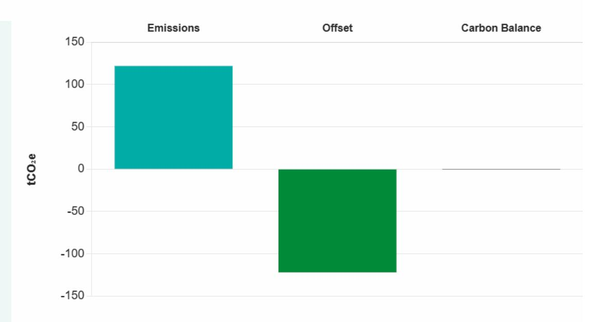
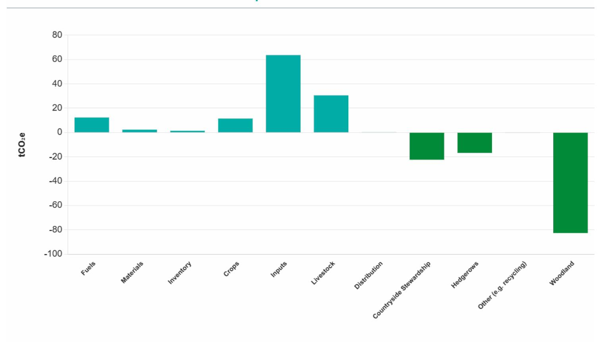

# [Botany](https://calculator.farmcarbontoolkit.org.uk/node/18226) Farms 30 Sep 2023

Prepared using UK as the region in the Farm Carbon Calculator.

## Carbon balance

## **Emissions**

**121.90**

tonnes CO e per year 2

## **Offset**

**-121.93**

tonnes CO e per year 2

## **Carbon**

**Balance**

**-0.03**

tonnes CO e per year 2

## KPIs

| Carbon Balance / hectare:  | Carbon Balance / tonne: | Fuel / hectare:         |  |  |
|-------------------------------------|----------------------------------|-------------------------------|--|--|
| 0.00                                | -0.0001                          | 0.1365                        |  |  |
| tonnes CO2e/hectare/year            | tonnes CO2e/tonne of product     | tonnes CO2e/hectare from fuel |  |  |
| Fertiliser emissions:            | Water:                           | Carbon Income:             |  |  |
| 0.4914                              | 0.0345                           | £0.00                         |  |  |
| tonnes CO2e per ha from fertilisers | m3 water per tonne of product    | carbon income (£)             |  |  |

## Breakdown of Emissions and Sequestration

## Table of Emissions and Sequestration

| Emissions    | tonnes CO e per year 2 | %      |
|--------------|---------------------------|--------|
| Fuels        | 12.31                     | 10.10% |
| Materials    | 2.32                      | 1.90%  |
| Inventory    | 1.42                      | 1.16%  |
| Crops        | 11.44                     | 9.38%  |
| Inputs       | 63.61                     | 52.18% |
| Livestock    | 30.51                     | 25.03% |
| Distribution | 0.29                      | 0.24%  |
| Total        | 121.90                    | 100%   |

| Offset                  | tonnes CO e per year 2 | %      |
|-------------------------|---------------------------|--------|
| Countryside Stewardship | -22.35                    | 18.33% |
| Hedgerows               | -16.75                    | 13.74% |
| Other (E.G. Recycling)  | -0.17                     | 0.14%  |
| Woodland                | -82.65                    | 67.79% |
| Total                   | -121.93                   | 100%   |

# Emissions by Scope & Greenhouse Gas

| Emissions by Scope |                               |                               | By GHGs                       |                                        |                 |                 |                                        |                             |
|--------------------|-------------------------------|-------------------------------|-------------------------------|----------------------------------------|-----------------|-----------------|----------------------------------------|-----------------------------|
| Emissions          | Scope 1 tCO 2 e | Scope 2 tCO 2 e | Scope 3 tCO 2 e | Outside of Scope tCO 2 e | CO 2 | CH 4 | N 2 O tCO 2 e | Total tCO 2 e |
| Fuels              | 9.89                          | 0.11                          | 2.32                          | 0.00                                   | 12.31           | 0.00            | 0.00                                   | 12.31                       |
| Materials          | 0.00                          | 0.00                          | 2.32                          | 0.00                                   | 2.32            | 0.00            | 0.00                                   | 2.32                        |
| Inventory          | 0.00                          | 0.00                          | 1.42                          | 0.00                                   | 1.42            | 0.00            | 0.00                                   | 1.42                        |
| Crops              | 11.44                         | 0.00                          | 0.00                          | 0.00                                   | 8.41            | 0.00            | 3.03                                   | 11.44                       |
| Inputs             | 22.38                         | 0.00                          | 41.23                         | 0.00                                   | 55.42           | 0.00            | 8.19                                   | 63.61                       |
| Livestock          | 30.51                         | 0.00                          | 0.00                          | 0.00                                   | 0.00            | 28.88           | 1.63                                   | 30.51                       |
| Distribution       | 0.00                          | 0.00                          | 0.29                          | 0.00                                   | 0.29            | 0.00            | 0.00                                   | 0.29                        |
| Total              | 74.22                         | 0.11                          | 47.58                         | 0.00                                   | 80.17           | 28.88           | 12.86                                  | 121.91                      |

## Yield

| Total Production          | Units  | Yield  |
|---------------------------|--------|--------|
| Crops: Agricultural Crops | tonnes | 332.22 |

#### Common Land

| Area  | Subdivision | Emissions (tCO 2 e) | Active Livestock Units |
|-------|-------------|--------------------------------|------------------------|
|       | 0           | 0.00                           | 0                      |
| Total |             | 0.00                           | 0                      |

## Farm details

Report type

Standard

Region

UK

#### Report Disclaimer

This Carbon Footprint Report has been generated using the Farm Carbon Calculator, a software tool developed by the Farm Carbon Toolkit. Alongside Farm Carbon Toolkit's General Terms & Conditions, please read this disclaimer carefully before interpreting or relying upon the information presented in this report.

- **Data Input Responsibility:** The accuracy and completeness of the carbon footprint calculations depend on the quality and accuracy of the data inputted into the Farm Carbon Calculator. Users of this report are responsible for providing accurate and reliable data, understanding that any inaccuracies or omissions may affect the calculated results.
- **Accuracy and Assumptions:** The carbon footprint calculations and any benchmarks presented in this report are calculated using a variety of standards and protocols, with emissions factors drawn from scientific literature and industry data. While every effort has been made to draw on high-quality and up-to-date information, users should understand that there can be inherent limitations and uncertainties associated with the underlying methodology and data sources.
- **General Information:** This Carbon Footprint Report is intended to provide general information and estimates regarding greenhouse gas emissions, carbon sequestration, and nitrogen balance. For specific advice or guidance, we recommend supplementary consultation with appropriate experts or advisors.
- **Use of Report Data within the Voluntary Carbon Marketplace:** The Farm Carbon Toolkit acknowledges that some users of the Farm Carbon Calculator may be interested in participating in the voluntary carbon marketplace. It is essential to note that this Carbon Footprint Report should not be used as the sole basis for participating in carbon offsetting schemes without the implementation of an independent verification process. It is strongly recommended that any carbon offsetting scheme adheres to recognized best practices, such as The Oxford Principles for Net Zero Aligned Carbon Offsetting, which address important considerations such as additionality, permanence, and double-counting.
- **Limitation of Liability:** The Farm Carbon Toolkit and its staff shall not be held liable for any direct, indirect, incidental, consequential, or punitive damages arising from the use of this Carbon Footprint Report, including but not limited to any errors, omissions, or misinterpretation of the information presented.
- **Third-Party Content and Links:** This Carbon Footprint Report may contain references to third-party content or websites. The Farm Carbon Toolkit does not endorse or assume any responsibility for the accuracy, completeness, or reliability of such content or websites.

By using this Carbon Footprint Report, you acknowledge and agree to the terms and conditions outlined in this disclaimer.

**Report downloaded:** 28/02/2024 08:26

## Full Data

| Fuels                       |                             |                  |        |            |      |
|-----------------------------|-----------------------------|------------------|--------|------------|------|
| Diesel                      |                             |                  |        |            |      |
| Description                 | Usage                       | tonnes CO e 2 | %      | Confidence | Link |
| Red diesel (gas oil)        | 3,420 Litres                | 11.60            | 94.20% |            |      |
| Road diesel                 | 110 Litres                  | 0.35             | 2.83%  |            |      |
| Electricity                 |                             |                  |        |            |      |
| Description                 | Usage                       | tonnes CO e 2 | %      | Confidence | Link |
| Average tariff              | 550 Kilowatt hours (kWh) | 0.14             | 1.17%  |            |      |
| Liquid fuels             |                             |                  |        |            |      |
| Description                 | Usage                       | tonnes CO e 2 | %      | Confidence | Link |
| Petrol                      | 80 Litres                   | 0.22             | 1.80%  |            |      |
| Materials                   |                             |                  |        |            |      |
| Aggregate                   |                             |                  |        |            |      |
| Description                 | Usage                       | tonnes CO e 2 | %      | Confidence | Link |
| Average aggregate by weight | 2 Tonnes                    | 0.01             | 0.64%  |            |      |
| Cement                      |                             |                  |        |            |      |
| Description                 | Usage                       | tonnes CO e 2 | %      | Confidence | Link |
| General cement by weight    | 0 Tonnes                    | 0.04             | 1.79%  |            |      |
| Complete fencing         |                             |                  |        |            |      |

| Description                | Usage        | tonnes CO e 2 | %      | Confidence | Link |
|----------------------------|--------------|------------------|--------|------------|------|
| Barbed wire (3 strands)    | 1,391 Metres | 2.06             | 88.54% |            |      |
| Roads & tracks       |              |                  |        |            |      |
| Description                | Usage        | tonnes CO e 2 | %      | Confidence | Link |
| Recycled Asphalt Plannings | 6 Tonnes     | 0.12             | 5.04%  |            |      |
| Stone                      |              |                  |        |            |      |
| Description                | Usage        | tonnes CO e 2 | %      | Confidence | Link |
| General stone by weight    | 1 Tonnes     | 0.08             | 3.40%  |            |      |
| Limestone by weight        | 0 Tonnes     | 0.01             | 0.50%  |            |      |
|                            |              |                  |        |            |      |

## **Water & Sewage**

| Description | Usage                   | tonnes CO e 2 | %     | Confidence | Link |
|-------------|-------------------------|------------------|-------|------------|------|
| Mains water | 11 Metres cubed (m3) | 0.00             | 0.07% |            |      |

### [Inventory](https://calculator.farmcarbontoolkit.org.uk/#)

#### **Farm Machinery - Fore end loaders**

| Description         | Usage         | tonnes CO e 2 | %      | Confidence | Link |
|---------------------|---------------|------------------|--------|------------|------|
| LuiGong mini digger | 21 Horsepower | 0.84             | 59.08% |            |      |

### **Implements (by weight)**

| Description                   | Usage                | tonnes CO e 2 | %     | Confidence | Link |
|-------------------------------|----------------------|------------------|-------|------------|------|
| ATV trailed flail mower 120FM | 0 Tonnes of metal | 0.08             | 5.38% |            |      |

#### **Road vehicles - Cars and Vans**

| Description           | Usage                           | tonnes CO e 2 | %      | Confidence | Link |
|-----------------------|---------------------------------|------------------|--------|------------|------|
| Honda ATV- TRX500 FA6 | 7,000 £ spent on new vehicle | 0.50             | 35.54% |            |      |

#### [Crops](https://calculator.farmcarbontoolkit.org.uk/#)

#### **Agricultural crops**

| Description | Usage                   | tonnes CO e 2 | %      | Confidence | Link |
|-------------|-------------------------|------------------|--------|------------|------|
| Barley      | 129 Tonnes harvested | 4.21             | 36.79% |            |      |
| Linseed     | 30 Tonnes harvested  | 2.71             | 23.69% |            |      |
| Wheat       | 173 Tonnes harvested | 4.52             | 39.52% |            |      |

#### [Inputs](https://calculator.farmcarbontoolkit.org.uk/#)

#### **Fertiliser**

| Description  | Usage     | tonnes CO e 2 | %      | Confidence | Link |
|--------------|-----------|------------------|--------|------------|------|
| Custom blend | 19 Tonnes | 44.33            | 69.69% |            |      |

#### **Sprays - Generic**

| Description      | Usage                          | tonnes CO e 2 | %      | Confidence | Link |
|------------------|--------------------------------|------------------|--------|------------|------|
| Fungicide        | 15 Kg of active ingredient  | 0.43             | 0.68%  |            |      |
| Growth Regulator | 60 Kg of active ingredient  | 1.14             | 1.79%  |            |      |
| Herbicide        | 663 Kg of active ingredient | 17.66            | 27.76% |            |      |
| Insecticide      | 0 Kg of active ingredient   | 0.00             | 0.01%  |            |      |
| Molluscicide     | 4 Kg of active ingredient   | 0.04             | 0.06%  |            |      |

### [Livestock](https://calculator.farmcarbontoolkit.org.uk/#)

#### **Sheep**

| Description | Usage                                                           | tonnes CO e 2 | %      | Confidence | Link |
|-------------|-----------------------------------------------------------------|------------------|--------|------------|------|
| Ewes        | 115 Average head of livestock on farm during last year | 24.94            | 81.73% |            |      |
| Lambs       | 60 Average head of livestock on farm during last year  | 5.58             | 18.27% |            |      |

#### Waste - [Offsets](https://calculator.farmcarbontoolkit.org.uk/#)

#### **Plastics (Recycling)**

| Description | Usage    | tonnes CO e 2 | %       | Confidence | Link |
|-------------|----------|------------------|---------|------------|------|
| HDPE        | 0 Tonnes | -0.17            | 100.00% |            |      |

#### [Distribution](https://calculator.farmcarbontoolkit.org.uk/#)

#### **Contracted**

| Description | Usage                            | tonnes CO e 2 | %       | Confidence | Link |
|-------------|----------------------------------|------------------|---------|------------|------|
| HGV (33t +) | 21 Delivery distance in miles | 0.29             | 100.00% |            |      |

| Sequestration |
|---------------|
|---------------|

#### **AB1 - Nectar Flower Mix**

| Description            | Usage           | tonnes CO e 2 | %     | Confidence | Link |
|------------------------|-----------------|------------------|-------|------------|------|
| Baseline: winter wheat | 2 Hectares (ha) | -9.77            | 8.02% |            |      |

#### **AB9 - Winter bird food**

| Description            | Usage           | tonnes CO e 2 | %      | Confidence | Link |
|------------------------|-----------------|------------------|--------|------------|------|
| Baseline: winter wheat | 2 Hectares (ha) | -12.58           | 10.33% |            |      |

#### **Hedgerows**

| Description                         | Usage                     | tonnes CO e 2 | %      | Confidence | Link |
|-------------------------------------|---------------------------|------------------|--------|------------|------|
| Hedgerows (large growth with trees) | 8,046 Length in metres | -16.28           | 13.37% |            |      |
| Hedgerows (managed)                 | 1,714 Length in metres | -0.47            | 0.39%  |            |      |

### **Species and age specific**

| Description | Usage           | tonnes CO e 2 | %      | Confidence | Link |
|-------------|-----------------|------------------|--------|------------|------|
| Mixed       | 4 Hectares (ha) | -82.65           | 67.88% |            |      |