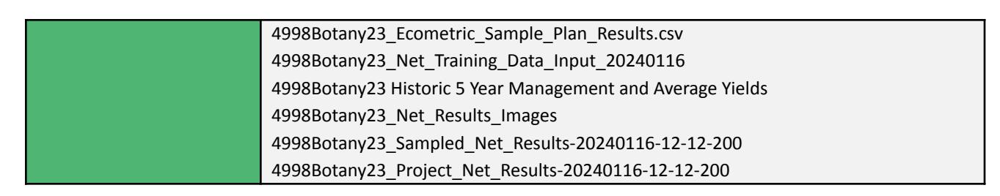

# REGISTRY AGENT REVIEW

### Credit Issuance

| Project Name                                  | Botany Farm Partnership                                                                                                                                                                                                                                                                                                                                                                                                                                                                                                                                                                                                                                                                                                                       |
|--------------------------------------------------|-----------------------------------------------------------------------------------------------------------------------------------------------------------------------------------------------------------------------------------------------------------------------------------------------------------------------------------------------------------------------------------------------------------------------------------------------------------------------------------------------------------------------------------------------------------------------------------------------------------------------------------------------------------------------------------------------------------------------------------------------------|
| Project ID                                    | C06-006                                                                                                                                                                                                                                                                                                                                                                                                                                                                                                                                                                                                                                                                                                                                             |
| Reporting Period                              | 01/01/2022 - 01/01/2023                                                                                                                                                                                                                                                                                                                                                                                                                                                                                                                                                                                                                                                                                                                       |
| Date of Submission                         | 11/20/2024                                                                                                                                                                                                                                                                                                                                                                                                                                                                                                                                                                                                                                                                                                                                          |
| Credit Protocol                               | GHG Benefits in Managed Crop and Grassland Systems 1.5.1 Methodology: Soil Organic Carbon Estimation in Regenerative Cropping and Managed Grassland Ecosystems. v 1.1                                                                                                                                                                                                                                                                                                                                                                                                                                                                                                             |
| Regen Registry Program Guide Version | 1.1                                                                                                                                                                                                                                                                                                                                                                                                                                                                                                                                                                                                                                                                                                                                                 |
| Project Proponent                             | David Wright, ecometric Ltd.                                                                                                                                                                                                                                                                                                                                                                                                                                                                                                                                                                                                                                                                                                               |
| Registry Agents                               | Rebecca Harman, Regen Network Development, PBC.                                                                                                                                                                                                                                                                                                                                                                                                                                                                                                                                                                                                                                                                                      |
| Documents Submitted                           | 4997Botany22 Soil Organic Carbon Project Report - Baseline 4998Botany23 Soil Organic Carbon Project Report - Monitoring Round 2023 4998Botany23_GHG_Emissions_30_Sep_2023.pdf Emissions Raw Data: Soil Samples, Carbon Data Collection, Spray & Fertilizer, Equipment List, Cultivation, Drilling, Fertilising and Harvesting Fuel use, Fuel Usage, SOYL Maps, Stewardship Areas 4998Botany23_Ecometric_Sample_Blocks-4326.shp 4998Botany23_Ecometric_Sample_Cores-4326.shp 4998Botany23_Ecometric_Sample_Fields-4326.shp 4998Botany23_Sample_Points_4326.shp 4998Botany23_Ecometric_Sample_Plan |

### **1 Registry Agent Review Overview**

### **Registry Agent Role in Credit Issuance**

The Registry Agent serves as the primary evaluator for projects seeking to issue credits under the Regen Registry Program. During credit issuance review, the Registry Agent conducts a comprehensive assessment of the Monitoring Report and supporting documentation to verify compliance with Program Guide and Credit Protocol requirements. The Registry Agent must ensure that all monitoring and verification elements are properly documented and all requirements have been met before credits can be issued on Regen Ledger.

### **Registry Agent Review Checklist**

The Registry Agent Review Checklist provides a systematic framework for evaluating project compliance with the Regen Registry Program Guide and associated Credit Protocol. The checklist is organized by key requirements, with each requirement referencing specific Program Guide or Credit Protocol sections, defining required evidence, providing space to document submitted evidence, and including approval status and Registry Agent comments. Each requirement is assessed individually with decisions based on concrete evidence. This structured approach ensures thorough review of documentation while maintaining consistency across different projects and reviewers.

### **Approval Categories**

Approval determinations are made based on concrete evidence submitted by Project Proponents. For each requirement, the Registry Agent must verify that submitted evidence adequately demonstrates compliance. When evidence is insufficient or missing, the Registry Agent documents specific deficiencies and required actions for the Project Proponent.

Approval Categories indicate whether a submission meets Program requirements.

- Approved: The submitted evidence fully satisfies the requirements
- Not Approved: The evidence is either insufficient or missing, requiring additional documentation or clarification (note: projects may request requirements deviations is unable to provide sufficient evidence)

Approval means that the Registry Agent found that the project fully met the requirements for credit issuance with the submission of the Monitoring Report and supplementary documentation.

## **2 Review Outcome**

### **Review Status**

[ ✓] Approved

[ ] Not Approved

### **Outcome Summary**

*The Neesham Farm submission for issuance has been approved for credit issuance, having successfully met all required criteria under the Regen Registry Program Guide and the GHG Benefits in Managed Crop and Grassland Systems Credit Protocol. The submitted Monitoring Report, soil sampling data, AI-driven SOC analysis, and emissions calculations were reviewed and found to be compliant with program requirements.*

*A signed statement of fiduciary obligation is forthcoming, which does not affect the conservativeness of the project. Note that the Registry Agents were not able to open the files in the "AI" folder based on the file types; the Verifier will need to access and check those files.*

*No further action is required at this stage, and credits are now eligible for issuance on Regen Ledger.*

#### **Required Actions**:

● None

## **2.2 3 Registry Agent Review Checklist**

| Credit Issuance    |                                                                                                                                                                                                                                                                                                                                                  |                                                                                                                                      |                                                                                                                                                                                                                                                                                                                                                                               |          |          |  |
|-----------------------|--------------------------------------------------------------------------------------------------------------------------------------------------------------------------------------------------------------------------------------------------------------------------------------------------------------------------------------------------|--------------------------------------------------------------------------------------------------------------------------------------|-------------------------------------------------------------------------------------------------------------------------------------------------------------------------------------------------------------------------------------------------------------------------------------------------------------------------------------------------------------------------------|----------|----------|--|
| Category              | Requirement                                                                                                                                                                                                                                                                                                                                      | Accepted Evidence                                                                                                                 | Submitted Material                                                                                                                                                                                                                                                                                                                                                         | Approved | Comments |  |
| Project Boundaries | Clearly define the project area using geographic boundaries, with eligible and ineligible portions clearly demarcated Source: Methodology, Section 2.1                                                                                                                                     | ESRI polygon shapefiles, KML/KMZ files, GeoJSON                                                                       | Primary Documentation: 4997Botany22 Soil Organic Carbon Project Report: Baseline 2022 Figure 1 & 4998Botany23 Monitoring Round Report 2023 - Figure 1 Project SOCS Supplementary Evidence: 4998Botany23_Ecometric_Sample_ Blocks-4326.shp; 4998Botany23_Ecometric_Sample_ Fields-4326.shp | Approved |          |  |
| Data Reporting     | Must include summary quantification results, number of credits Project Proponent is eligible for, apply any estimation uncertainty deductions, follow templates and procedures of approved Credit Protocol; must include soil sampling, analysis of | Stated in Monitoring Report, Soil Samples, Analysis of Samples, SOC Maps in Monitoring Report | Primary Documentation: 4998Botany23 Soil Organic Carbon Project Report - Monitoring Report 2023: Executive Summary, Figures 1, 2 and 3 Supplementary Evidence: 4998Botany23_GHG_Emissions_30 _Sep_2023.pdf;                                                                                                 | Approved |          |  |

|                                            | samples, equations and references, the SOC maps                                                                                                                                                                                                                                                       |                                                                                                                                                                                                | 4998Botany23_Ecometric_Sample_ Plan                                                                                                                                                                                                                                        |          |                                                                                                                                                                |
|--------------------------------------------|-------------------------------------------------------------------------------------------------------------------------------------------------------------------------------------------------------------------------------------------------------------------------------------------------------------------------|------------------------------------------------------------------------------------------------------------------------------------------------------------------------------------------------|-------------------------------------------------------------------------------------------------------------------------------------------------------------------------------------------------------------------------------------------------------------------------------|----------|----------------------------------------------------------------------------------------------------------------------------------------------------------------|
|                                            | Source: Program Guide, Section 11.3.4, Methodology Section 5                                                                                                                                                                                                                                       |                                                                                                                                                                                                |                                                                                                                                                                                                                                                                               |          |                                                                                                                                                                |
| Project Monitoring                      | Describe the current status of project operation, and include the data monitored, the monitoring plan, the calculated emission reductions and ecological indicators for the Reporting Period                                                 | Stated in Monitoring report                                                                                                                                                           | Primary Documentation: 4998Botany23 Soil Organic Carbon Project Report - Monitoring Report 2023: Table 2: Carbon Balance; Appendix: Project Information, Monitored Impact Information, Summary,             | Approved |                                                                                                                                                                |
|                                            | Source: Program Guide, Section 9.2.2; Methodology, Section 5                                                                                                                                                                                                                                       |                                                                                                                                                                                                | Supplementary Evidence: 4998Botany23_GHG_Emissions_30 _Sep_2023.pdf                                                                                                                                                                                                  |          |                                                                                                                                                                |
| Monitoring Period                       | Define the current monitoring period, including start and end dates. Source: Program Guide Section 11.6                                                                                                                                                                       | Monitoring period dates clearly stated in the report                                                                                                                      | Primary Documentation: 4998Botany23 Soil Organic Carbon Project Report - Monitoring Round Report 2023:, Executive Summary, Project Outline                                                                                    | Approved | Monitoring year 2023                                                                                                                                     |
| Soil Sampling Methods & Scheme | Sampling Design: Provide sampling stratification design with average strata size, core numbers per stratum, including method for assigning strata boundaries and core locations. A minimum of 10 soil cores per stratum is | Stratification map showing sampled area, soil Sample Report from the laboratory, description of method for strata determination and size | Primary Documentation: 4998Botany23 Soil Organic Carbon Project Report - Monitoring Round Report 2023: Figure 2: Monitoring Period Net SOCS Change; Appendix: Sampling Method Supplementary Evidence: | Approved | Change from 1 ha grid 50% coverage to 4 ha grid 100% coverage between baseline and next monitoring round |

| required.              |                         |                                              | 4998Botany23_Ecometric_Sample_                |          |  |
|------------------------|-------------------------|----------------------------------------------|-----------------------------------------------|----------|--|
|                        |                         |                                              | Plan;                                         |          |  |
| Source:                | Methodology, Section |                                              | 4998Botany23_Ecometric_Sample_                |          |  |
| 5.1.1                  |                         |                                              | Plan_Results.csv;                             |          |  |
|                        |                         |                                              | 4998Botany23_Ecometric_Sample_                |          |  |
|                        |                         |                                              | Blocks-4326.shp;                              |          |  |
|                        |                         |                                              | 4998Botany23_Ecometric_Sample_                |          |  |
|                        |                         |                                              | Cores-4326.shp;                               |          |  |
|                        |                         |                                              | 4998Botany23_Ecometric_Sample_                |          |  |
|                        |                         |                                              | Fields-4326.shp                               |          |  |
| Sampling Depth:     | Soil samples         | Soil Sample Report detailing        | Primary Documentation:                     | Approved |  |
| will be taken    | to a depth of  | sampling depth and compositing      | 4998Botany23 Soil Organic Carbon     |          |  |
| 0-30cm, and         | all cores within  | method                                       | Project Report - Monitoring Round |          |  |
| each stratum        | must be              |                                              | Report 2023: Appendix: Sampling      |          |  |
| composited             | into a single     |                                              | Method                                        |          |  |
| sample. Consistent  | sampling                |                                              |                                               |          |  |
| depth.                 |                         |                                              | Supplementary Evidence:                    |          |  |
|                        |                         |                                              | 4998Botany23_Ecometric_Sample_                |          |  |
| Source:                | Methodology, Section |                                              | Plan_Results.csv, Column W              |          |  |
| 3.4                    |                         |                                              |                                               |          |  |
| Sampling               | location:               | List of geolocations of in-field | Supplementary Evidence:                    | Approved |  |
| geo-locations          | of the actual     | core positions                            | 4998Botany23_Ecometric_Sample_                |          |  |
| in-field core       | positions will be |                                              | Blocks-4326.shp;                              |          |  |
| reported by         | the sampling team |                                              | 4998Botany23_Ecometric_Sample_                |          |  |
| and recorded        | in supporting        |                                              | Cores-4326.shp;                               |          |  |
| data to evidence | that the             |                                              | 4998Botany23_Ecometric_Sample_                |          |  |
| sampling scheme     | was followed         |                                              | Fields-4326.shp                               |          |  |
| Source:                | Methodology, Section |                                              |                                               |          |  |
| 3.5.1                  |                         |                                              |                                               |          |  |

|                 | Sampler Details: Report of the    | Description of sampling event    | Primary Documentation:                       | Approved |  |
|-----------------|-----------------------------------------------|-------------------------------------------|-------------------------------------------------|----------|--|
|                 | sampling date, contractor and        | and compositing method              | 4998Botany23 Soil Organic Carbon       |          |  |
|                 | equipment including tool                |                                           | Project Report - Monitoring Round   |          |  |
|                 | diameter for core samplers           |                                           | Report 2023: Project Outline table; |          |  |
|                 | and proper compositing                  |                                           | Appendix: Sampling Method                 |          |  |
|                 | techniques                                    |                                           |                                                 |          |  |
|                 |                                               |                                           | Supplementary Evidence:                      |          |  |
|                 | Source: Methodology, Section            |                                           | 4998Botany23_Ecometric_Sample_                  |          |  |
|                 | 5.1.1                                         |                                           | Plan_Results.csv: Columns R;              |          |  |
|                 |                                               |                                           | Appendix Sampling Method                  |          |  |
|                 | GNSS Accuracy: Record the            | GNSS device details, accuracy    | Primary Documentation:                       | Approved |  |
|                 | accuracy of GNSS used for soil | report (minimum ±4m) for all  | 4998Botany23 Soil Organic Carbon       |          |  |
|                 | sampling locations. Minimum             | recorded soil sample locations   | Project Report - Monitoring Round   |          |  |
|                 | accuracy should be ±4m.              |                                           | Report 2023: Appendix: Sampling        |          |  |
|                 |                                               |                                           | Method                                          |          |  |
|                 | Source: Methodology, Section            |                                           |                                                 |          |  |
|                 | 3.5.4                                         |                                           |                                                 |          |  |
|                 | Analysis Parameters: SOC %           | Laboratory analysis indicating      | Primary Documentation:                       | Approved |  |
|                 | analysis must follow standard        | analysis method used and         | 4998Botany23 Soil Organic Carbon       |          |  |
|                 | recommendations and be                  | showing %SOC, total soil         | Project Report - Monitoring Round   |          |  |
|                 | reported. Same analysis type         | volume, bulk density, and SOC | Report 2023: Sampling Method,          |          |  |
|                 | continued through the                   | stock calculation                      | DUMAS method                                 |          |  |
|                 | crediting period.                          |                                           |                                                 |          |  |
|                 |                                               |                                           | Supplementary Evidence:                      |          |  |
| SOC Analysis | Source: Methodology, Section            |                                           | 4998Botany23_Ecometric_Sample_                  |          |  |
|                 | 5.1.1                                         |                                           | Plan_Results: Column V Bulk            |          |  |
|                 |                                               |                                           | density, Column AE SOC, Column      |          |  |
|                 |                                               |                                           | AH SOCS                                      |          |  |
|                 | Laboratory: include name and         | Name and accreditation of        | Primary Documentation:                       | Approved |  |
|                 | accreditation                                 | laboratory                                | 4998Botany23 Soil Organic Carbon       |          |  |
|                 |                                               |                                           | Project Report - Monitoring Round   |          |  |

|    | Source: Methodology, Section 5.1.1                                                                                                                                           |                                                                                                    | Report 2023: Appendix: Laboratory Analysis                                                                                                                                                                                                                                                                           |          |                                                                         |
|----|---------------------------------------------------------------------------------------------------------------------------------------------------------------------------------------|----------------------------------------------------------------------------------------------------|----------------------------------------------------------------------------------------------------------------------------------------------------------------------------------------------------------------------------------------------------------------------------------------------------------------------------------|----------|-------------------------------------------------------------------------|
| AI | Training: Inclusion of AI training method summary Source: Methodology, Section 5.1.1                                                                    | Description in monitoring report                                                          | Primary Documentation: 4998Botany23 Soil Organic Carbon Project Report - Monitoring Round Report 2023: Appendix: AI Processing Supplementary Evidence: 4998Botany23_Net_Training_Data_I nput_20240116                                                                   | Approved |                                                                         |
|    | Accuracy: Detailing of method used to quantify AI accuracy during monitoring period Source: Methodology, Section 5.1.1                   | Description in monitoring report                                                          | Primary Documentation: 4998Botany23 Soil Organic Carbon Project Report - Monitoring Round Report 2023: Appendix: AI Processing, Accuracy Supplementary Evidence: 4998Botany23_Net_Training_Data_I nput_20240116                                                      | Approved |                                                                         |
|    | Network Prediction Uncertainty: The network prediction uncertainty will be quantified using the MAPE Source: Methodology, Section 3.7 | MAPE calculation for network prediction uncertainty, under 20% uncertainty | Primary Documentation: 4998Botany23 Soil Organic Carbon Project Report - Monitoring Round Report 2023: Appendix: AI Processing Supplementary Evidence: 4998Botany23_Sampled_Net_Resul ts-20240116-12-12-200; 4998Botany23_Project_Net_Results -20240116-12-12-200 | Approved | MAPE reported at 7.12% for 2022, 4.98% for 2023 |

| Image & Ancillary Data Processing | Use imagery with a sensing date as close as possible to the sampling date, but within ±4 months Source: Methodology, Section 3.5.7 | Imagery and ancillary data reports, including sensing dates and processing logs                                                                                                                              | Primary Documentation: 4998Botany23 Soil Organic Carbon Project Report - Monitoring Round Report 2023: Appendix: AI Results Supplementary Evidence: 4998Botany23_Net_Results_Image;                                                                                                                                                                                                                                                                                                                                                                                                                | Approved | Registry Agents unable to open .mat file types and cross check their contents. |
|-----------------------------------------------|---------------------------------------------------------------------------------------------------------------------------------------------------------------------------------------------------|--------------------------------------------------------------------------------------------------------------------------------------------------------------------------------------------------------------------------------------------|----------------------------------------------------------------------------------------------------------------------------------------------------------------------------------------------------------------------------------------------------------------------------------------------------------------------------------------------------------------------------------------------------------------------------------------------------------------------------------------------------------------------------------------------------------------------------------------------------------------------------------------------------------|----------|--------------------------------------------------------------------------------------------------------------------|
|                                               |                                                                                                                                                                                                   |                                                                                                                                                                                                                                            | 4998Botany23_Sampled_Net_Resul ts-20240116-12-12-200; 4998Botany23_Project_Net_Results -20240116-12-12-200                                                                                                                                                                                                                                                                                                                                                                                                                                                                                                                                      |          |                                                                                                                    |
| Results                                       | AI SOC Results: Show field level results in numerical and map form for AI SOC results. Source: Methodology, Section 5.1.1                | Field results with field area (ha), monitoring interval crop type, Net mean SOCS after deduction of MAPE. After baseline, results listed for previous and current. | Primary Documentation: 4998Botany23 Soil Organic Carbon Project Report - Monitoring Round Report 2023:, Figure 1: Project SOCS, Figure 2: Monitoring Period Net SOCS Change, Figure 3: SOC Results Map Secondary Evidence: 4998Botany23_GHG_Emissions_30 _Sep_2023.pdf; Emissions Raw Data: Soil Samples, Carbon Data Collection, Spray & Fertilizer, Equipment List, Cultivation, Drilling, Fertilising and Harvesting Fuel use, Fuel Usage, SOYL Maps, Stewardship Areas | Approved |                                                                                                                    |
|                                               | Soil sample results: Show in numerical and map form the tabulated results by field of sampling                                                       | Sampling report to include crop type, sampled field area, SOCS total (t/ha), stone content %, SOCS field total (t)                                                                   | Primary Documentation: 4998Botany23 Soil Organic Carbon Project Report - Monitoring Round Report 2023: Project Outline with                                                                                                                                                                                                                                                                                                                                                                                                                                                                                 | Approved |                                                                                                                    |

|           | Source: Methodology, Section 5.1.1                                                                                           |                                                                                                                           | sampling dates, number of samples and SOC results Supplementary Evidence: 4998Botany23_Ecometric_Sample_ Plan_Results.csv: Crop type, field, stone content, SOC included                                                                                                                                 |          |  |
|-----------|---------------------------------------------------------------------------------------------------------------------------------------|---------------------------------------------------------------------------------------------------------------------------|----------------------------------------------------------------------------------------------------------------------------------------------------------------------------------------------------------------------------------------------------------------------------------------------------------------------------------------------------------------|----------|--|
|           | ΔSOC: SOCs change between monitoring rounds (tSOC] and [tCO2e] Source: Methodology, Section 5.1.1 | Map or Table showing SOC change between monitoring periods                                        | Primary Documentation: 4998Botany23 Soil Organic Carbon Project Report - Monitoring Round Report 2023: Table 2:Carbon Balance, Figure 3:SOC Results Map                                                                                                                                               | Approved |  |
|           | Current year GHG Emissions Source: Methodology, Section 5.1.1                                                    | Current year GHG Emission report references with link to detailed GHG Emission Report | Primary Documentation: 4998Botany23 Soil Organic Carbon Project Report - Monitoring Round Report 2023: Project Emissions Change 2022:2023, Table 2: Carbon Balance                                                                                                                                 | Approved |  |
| Emissions |                                                                                                                                       |                                                                                                                           | Supplementary Evidence: 4998Botany23_GHG_Emissions_30 _Sep_2023.pdf; Emissions Raw Data: Soil Samples, Carbon Data Collection, Spray & Fertilizer, Equipment List, Cultivation, Drilling, Fertilising and Harvesting Fuel use, Fuel Usage, SOYL Maps, Stewardship Areas |          |  |

|      | GHG Emissions change               | Documentation of GHG                        | Primary Documentation:                        | Approved |  |
|------|------------------------------------------|---------------------------------------------------|--------------------------------------------------|----------|--|
|      | between monitoring rounds          | emissions change                               | 4998Botany23 Soil Organic Carbon        |          |  |
|      | [tCO2e]                                  |                                                   | Project Report - Monitoring Round    |          |  |
|      |                                          |                                                   | Report 2023:Project Emissions              |          |  |
|      | Source: Methodology, Section       |                                                   | Change 2022:2023, Table 2: Carbon    |          |  |
|      | 5.1.1                                    |                                                   | Balance                                          |          |  |
|      |                                          |                                                   |                                                  |          |  |
|      |                                          |                                                   | Supplementary Evidence:                       |          |  |
|      |                                          |                                                   | 4998Botany23_GHG_Emissions_30                    |          |  |
|      |                                          |                                                   | _Sep_2023.pdf; Emissions Raw               |          |  |
|      |                                          |                                                   | Data: Soil Samples, Carbon Data      |          |  |
|      |                                          |                                                   | Collection, Spray & Fertilizer,         |          |  |
|      |                                          |                                                   | Equipment List, Cultivation, Drilling,  |          |  |
|      |                                          |                                                   | Fertilising and Harvesting Fuel use, |          |  |
|      |                                          |                                                   | Fuel Usage, SOYL Maps,                  |          |  |
|      |                                          |                                                   | Stewardship Areas                             |          |  |
|      | Emissions contractor: Contact      | Independent contractor contact              | Primary Documentation:                        | Approved |  |
|      | of independent contractor          |                                                   | 4998Botany23 Soil Organic Carbon        |          |  |
|      | used to gather GHG Emissions |                                                   | Project Report - Monitoring Round    |          |  |
|      | data and calculate GHG          |                                                   | Report 2023:, Appendix:                    |          |  |
|      | emissions                                |                                                   | Greenhouse Gas Emissions                   |          |  |
|      |                                          |                                                   | Monitoring                                       |          |  |
|      | Source: Methodology, Section       |                                                   |                                                  |          |  |
|      | 5.1.1                                    |                                                   | Supplementary Evidence:                       |          |  |
|      |                                          |                                                   | 4998Botany23_GHG_Emissions_30                    |          |  |
|      |                                          |                                                   | _Sep_2023.pdf                                    |          |  |
|      | Buffer Pool: Provide buffer     | Risk assessment reports and              | Primary Documentation:                        | Approved |  |
|      | pool contributions of each      | documentation of contributions              | 4998Botany23 Soil Organic Carbon        |          |  |
| Risk | issuance (if applicable)           | to buffer pools if reversals occur | Project Report - Monitoring Round    |          |  |
|      |                                          | or risks increase                           | Report 2023: Executive summary:         |          |  |
|      |                                          |                                                   | Permanence Buffer Credit                   |          |  |

|                   | Source: Program Guide, Section 10.2 |                                           | Contribution                                      |          |  |
|-------------------|-------------------------------------------------|-------------------------------------------|---------------------------------------------------|----------|--|
|                   | Leakage: Yield related leakage         | Report of crop yields showing | Primary Documentation:                         | Approved |  |
|                   | reported against 5-year                   | <10% reduction                         | 4998Botany23 Soil Organic Carbon         |          |  |
|                   | average crop yields (any crop       |                                           | Project Report - Monitoring Round     |          |  |
|                   | specific yield reduction of            |                                           | Report 2023: Executive Summary           |          |  |
|                   | >10% from 5-year average to         |                                           | Carbon Balance Table, Leakage            |          |  |
|                   | be justified against regional          |                                           |                                                   |          |  |
|                   | crop specific monitoring-year             |                                           | Supplementary Evidence:                        |          |  |
|                   | yield averages to differentiate        |                                           | 4998Botany23 Historic 5 Year             |          |  |
|                   | between                                         |                                           | Management and Average Yields:           |          |  |
|                   | potential leakage and regional         |                                           | Crop Report showing tons/ha per       |          |  |
|                   | performance trends).                         |                                           | crop; Ecometric Carbon Data - 2023 |          |  |
|                   |                                                 |                                           | Cropping Yields                                |          |  |
|                   | Source: Methodology, Section              |                                           |                                                   |          |  |
|                   | 5.1.1                                           |                                           |                                                   |          |  |
|                   | Carbon balance: Show                      | Carbon calculation results in    | Primary Documentation:                         | Approved |  |
|                   | calculation of carbon balance          | monitoring report                      | 4998Botany23 Soil Organic Carbon         |          |  |
|                   | [tCO2e] by deducting                      |                                           | Project Report Soil Organic Carbon    |          |  |
|                   | monitoring period GHG                     |                                           | Project Report - Monitoring Round     |          |  |
|                   | Emissions [tCO2e] from                    |                                           | Report 2023: Executive Summary:          |          |  |
|                   | monitoring period SOCS gains           |                                           | Carbon Balance, Table 2: Carbon       |          |  |
|                   | [tCO2e].                                        |                                           | Balance                                           |          |  |
| GHG Accounting |                                                 |                                           |                                                   |          |  |
|                   | Source: Methodology, Section              |                                           | Supplementary Evidence:                        |          |  |
|                   | 5.1.1                                           |                                           | 4998Botany23_Sampled_Net_Resul                    |          |  |
|                   |                                                 |                                           | ts-20240116-12-12-200;                            |          |  |
|                   |                                                 |                                           | 4998Botany23_Project_Net_Results                  |          |  |
|                   |                                                 |                                           | -20240116-12-12-200                               |          |  |

|                                       | CO2 equivalence: Statement defining positive carbon balance CO2e tonnes are allocated credits [1 Credit per tCO2e] (Methodology, Section 5.1.1). Source: Methodology, 1.1.                                                                                                                                                                                                             | Credit statement showing that the credit balance sub divides the allocated credit total into a buffer pool [20% of total] and credits pending issuance [80% of total] | Primary Documentation: 4998Botany23 Soil Organic Carbon Project Report - Monitoring Round Report 2023: Executive Summary, Credit Statement | Approved             |                                                         |
|---------------------------------------|-------------------------------------------------------------------------------------------------------------------------------------------------------------------------------------------------------------------------------------------------------------------------------------------------------------------------------------------------------------------------------------------------------------------------------------------------------|-----------------------------------------------------------------------------------------------------------------------------------------------------------------------------------------------------------------------------------------------------|--------------------------------------------------------------------------------------------------------------------------------------------------------------------------------------------|----------------------|---------------------------------------------------------|
| Disclosures                           | If Monitor is third party, must sign similar statement and Registry Agent/Project Proponent must be satisfied any potential conflicts can be mitigated Source: Program Guide, Section 11.1.3, 11.1.4 Monitors must disclose all relationships (familial/fiduciary) within past 3 years between Monitor and project/Project | Signed statement confirming fiduciary obligations Disclosure in Monitoring Report or separate document                                                                                                             | Not present No disclosure made                                                                                                                                                 | Approved Approved | In progress, will be added retroactively |
|                                       | Proponent Source: Program Guide, Section 11.1.5                                                                                                                                                                                                                                                                                                                                                                                        |                                                                                                                                                                                                                                                     |                                                                                                                                                                                            |                      |                                                         |
| Monitoring Procedure Deviations | Monitors must submit proposed project-specific deviations with evidence that the deviation does not affect the conservativeness of results.                                                                                                                                                                                                                                                        | Stated in Monitoring Report with sufficient evidence included or submitted supplementarily                                                                                                                            | No deviations reported                                                                                                                                                               | Approved             |                                                         |

|                          | Source: Program Guide, Section 11.4                                                                                                                                                                                                                                                                                                                                                                                                                            |                                                                                                                                                                        |                                                                        |          |                                      |
|--------------------------|----------------------------------------------------------------------------------------------------------------------------------------------------------------------------------------------------------------------------------------------------------------------------------------------------------------------------------------------------------------------------------------------------------------------------------------------------------------------------|------------------------------------------------------------------------------------------------------------------------------------------------------------------------|------------------------------------------------------------------------|----------|--------------------------------------|
| Verifier Requirements | Verifier shall be impartial, lawful, and competent with a proven background on social environmental audit. Project Developer must prove verifiers expertise as an annex to the documentation. The verifier must sign a statement confirming lack of conflict of interest with the project. Source: Program Guide Section 12.1.3. | Documentation demonstrating verifier's qualifications and expertise; signed statement of impartiality and conflict of interest. | N/A Verifier not contracted at time of submission | Approved | Will be added retroactively |