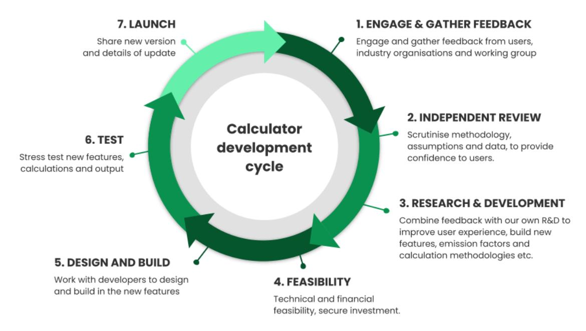

Dr. Lizzy Parker and Dr. James Pitman

Version 3.0

April 2024


## <span id="page-1-0"></span>**Table of Contents**

| Table of Contents                                 | 2  |
|---------------------------------------------------|----|
| Glossary                                          | 3  |
| 1. Introduction                                   | 4  |
| 2. About the Farm Carbon Calculator               | 4  |
| 3. How the Calculator is structured               | 4  |
| 4. Calculator Scope                               | 5  |
| 5. Accuracy of results                            | 5  |
| 6. References and assumptions                     | 6  |
| Proxy and actual data                             | 7  |
| 7. How do we calculate CO2e emissions?            | 7  |
| 7.1. Fuels                                        | 7  |
| Fuels and electricity                             | 7  |
| Travel                                            | 8  |
| Contractors                                       | 8  |
| 7.2. Materials                                    | 8  |
| 7.3. Inventory                                    | 9  |
| 7.4. Fertility & Cropping (Crops)                 | 10 |
| 7.5. Inputs                                       | 11 |
| Fertilisers                                       | 11 |
| Sprays                                            | 12 |
| 7.6. Livestock                                    | 12 |
| Livestock                                         | 12 |
| Animal feeds                                      | 15 |
| Animal bedding                                    | 16 |
| 7.7. Waste                                        | 16 |
| 7.8. Distribution                                 | 16 |
| 7.9. Sequestration                                | 17 |
| 7.10. Processing                                  | 18 |
| 8. Other Calculations we use                      | 19 |
| Fat and protein corrected milk (FPCM)             | 19 |
| Conversions from individual GHG emissions to CO2e | 20 |
| 9. What farm business information do users enter? | 20 |
| 10. Standards and compliance                      | 21 |
| 11. What's new and what's not included            | 21 |
| 12. Independent Reviews                           | 21 |


**13. [Development](#page-21-1) cycle 21 14. [Contacting](#page-22-0) us 22**

## <span id="page-2-0"></span>**Glossary**

**BEIS** Department for Business, Energy and Industrial Strategy **CH<sup>4</sup>** Methane **CO<sup>2</sup>** Carbon dioxide **CO2e** Carbon dioxide equivalent **FYM** Farm Yard Manure **GHG** Greenhouse Gas **IPCC** Intergovernmental Panel on Climate Change

**N2O** Nitrous oxide

**NH<sup>3</sup>** Ammonia

**PAS** Publicly Available Standard

**SOM** Soil Organic Matter **SOC** Soil Organic Carbon

**AD** Anaerobic Digestion

## **Document Version**

| Version     | Date        | Description                 |
|-------------|-------------|-----------------------------|
| Version 1.0 | August 2021 | Methodology draft finalised |
| Version 2.0 | May 2023    | Methodology draft revised   |
| Version 3.0 | April 2024  | Methodology draft revised   |

Last Updated: 2 Apr 2024 3


## <span id="page-3-0"></span>**1. Introduction**

The purpose of this document is to share details about the methodology that sits behind our Farm Carbon Calculator, a valuable tool used by thousands of farmers, growers and organisations to inform better decision making.

In a world grappling with the urgent task of rapidly reducing greenhouse gas emissions, we believe transparency in this sector is crucial. By sharing more about how farm-related greenhouse gas emissions are measured, we hope our calculator users and the wider public will have a greater understanding about the priorities and opportunities to make positive change. We also believe transparency will help build a greater trust and engagement with our community, with feedback that will further improve our calculator.

# <span id="page-3-1"></span>**2. About the Farm Carbon Calculator**

Started in 2008, the Farm Carbon Calculator is one of the longest running and most popular carbon calculators available in the UK. It is one of the three main carbon calculators for UK farmers and growers which are recommended by the NFU to its members. It enjoys widespread support from its users, both in terms of its comprehensive nature and ease of use.

The Calculator is owned and managed by the **Farm [Carbon](https://farmcarbontoolkit.org.uk/) Toolkit** (FCT), an enterprise that helps farmers and growers to measure, understand and take action to reduce their carbon emissions and increase carbon sequestration. FCT is run by farmers for farmers.

Over the years, the Calculator has attracted interest from other countries as well, showing its potential to positively influence carbon management on farms beyond the UK. From the outset, it has measured carbon sequestration and we remain a strong advocate of the potential for farmers and growers to sequester carbon in soils and biomass.

All users of the Farm Carbon Calculator accept a set of Terms and Conditions which are detailed on our website here: [https://farmcarbontoolkit.org.uk/terms](https://farmcarbontoolkit.org.uk/terms/).

## <span id="page-3-2"></span>**3. How the Calculator is structured**

The Calculator is split into ten sections, each subdivided into various input fields. Users enter data according to the following guidance:

- What is relevant to their business only
- Take a recent point in time and cover everything over the previous 12 months
- Capital items go in the Inventory section (e.g. machinery and buildings) and include everything under 10 years old


## <span id="page-4-0"></span>**4. Calculator Scope**

The Calculator has always been designed to be used as a whole farm carbon footprinting tool. However, it can also now be used to produce a footprint on a per product basis (e.g. wheat, milk, potatoes).

The boundary of the footprint is decided by the user and can be one of three options:

- 1. To farm gate only i.e. no transport of produce
- 2. Farm and distribution i.e. including transport to the customer
- 3. Farm and distribution through to final customer i.e. house doorstep

The Calculator can also be used to footprint other businesses such as processors, distributors or wholesalers - see our [services](https://farmcarbontoolkit.org.uk/commercial-services/) page.

The Calculator covers Scopes 1, 2 and 3 in its calculations:

| Scope 1       | Also known as direct emissions, these are emissions that are owned or controlled by<br>the company such as tractors, farm machinery, gas for heating and from change of<br>land use. Additional emissions arise from N2O released as a consequence of manure<br>storage and application. |
|---------------|------------------------------------------------------------------------------------------------------------------------------------------------------------------------------------------------------------------------------------------------------------------------------------------|
| Scope 2       | These are associated with emissions resulting from the generation of purchased<br>electricity used on the farm.                                                                                                                                                                          |
| Scope 3       | Also known as indirect emissions, associated with the production, processing and<br>distribution of inputs into the farming system. For example, fertilisers and the emissions<br>that occurred in the manufacture of machinery, building materials and other farm<br>infrastructure.    |
| Out of scopes | These are emissions associated with the combustion of biofuels, wood or crop biomass.                                                                                                                                                                                                    |

Users are encouraged to be as comprehensive as possible with the data they submit for their calculation, as this gives more assurance in terms of the reliability of the results.

All GHG fluxes are reported in the standard tonnes of CO2e. In the final report, a breakdown of fluxes from carbon dioxide (CO2), methane (CH4) and nitrous oxide (N2O) in tonnes of CO2e is given, as well as a breakdown of fluxes by scope.

# <span id="page-4-1"></span>**5. Accuracy of results**

The accuracy of a carbon footprint report is dependent on a number of factors, including:


- Accuracy of emissions factors;
- Whether a factor is based on actual or proxy values;
- Accuracy of both data collection and data input by the user;
- Level of completeness by the user.

At present, we do not offer verification of carbon reports for standard users of the Calculator, as this requires a detailed audit process. As part of our consultancy service, we do support farms and companies with enhanced footprint calculations and verifying the inputs, which provides a level of independent auditing. However we do not currently provide this service to a Third Party verification standard e.g. an ISO standard.

In the full results of carbon reports we provide a confidence level column. This ranges from 1 to 3, where results with 3 are those in which we have the most confidence in results. This scale is created by us through an understanding of the accuracy of the emissions/sequestration factors, as well as the likely limitations of user accuracy. For example for emissions from diesel we score this as a 3, because the emissions factors are accurate and we would expect users to have detailed information on their usage. Conversely, emissions from livestock are scored 1; whilst users will likely have detailed input data, emissions from biological systems are inherently variable which limits the level of certainty in these results.

## <span id="page-5-0"></span>**6. References and assumptions**

The majority of the emission and sequestration factors that underpin the Farm Carbon Calculator come from peer-reviewed scientific papers and we are transparent about these sources. A full list of current references and assumptions is provided on our website here:

<https://calculator.farmcarbontoolkit.org.uk/resources> or <https://calculator.farmcarbontoolkit.org.uk/references-0>

Each time we perform a major update to the calculator (typically annually), we review all references and factors; this comprises over 1000 data entry lines.

For ease of use, our calculator is divided into the following data input categories and in subsequent sections of this document, we cover the methodology and emission factors used in each:

- Fuels
- Materials
- Inventory/capital
- Fertility & Cropping (Crops)
- Inputs (agro-chemicals)
- Livestock
- Waste


- Distribution
- Land Use & sequestration
- Processing

### <span id="page-6-0"></span>**Proxy and actual data**

Some emissions factors are calculated based on actual data (e.g. litres of red diesel used), and some are based on proxy data (e.g. carbon sequestration of hedgerows). This depends on the availability of reference data for a particular item, and how practical it is for the user to provide data. Some items offer a choice between approaches depending on what information the user has access to – e.g. when tracking the emissions of a car, users have the option to fill actual data or proxy data. A user can either input fuel usage for their car directly if the fuel volume has been logged, or alternatively if the volume has not been recorded users can input the mileage driven by the user. The direct fuel usage provides a more accurate assessment of emissions, whereas the mileage provides a proxy value.

Users will not always have access to the equipment to directly measure GHG fluxes on their farms and so even where a user chooses the "actual" option to input data, the report for a farm or product is still an indirect assessment of its carbon footprint.

Users can, however, input direct measurements of soil organic matter (SOM) or soil organic carbon (SOC) which can be used as direct measures of GHG fluxes from soils. Indirect estimations of sequestration and land use related emissions can also be selected in the Calculator where SOM and SOC sampling is not available. If you are seeking to enter the voluntary carbon market, you should check the requirements of any scheme (more guidance here <https://farmcarbontoolkit.org.uk/toolkit-page/getting-paid-for-carbon/>).

## <span id="page-6-1"></span>**7. How do we calculate CO2e emissions?**

## <span id="page-6-2"></span>**7.1. Fuels**

Emissions from the use of fuels, electricity, travelling and contractors. These include scope 1 (direct), scope 2 (indirect emissions from purchased energy) and scope 3 (indirect – such as processing and transport) emissions, including 'well-to-tank' emissions factors.

#### <span id="page-6-3"></span>**Fuels and electricity**

All of the items in liquid fuels, electricity, gas fuels, heat & steam, solid fuels, accommodation, public transport and contractors are derived from BEIS GHG conversion factors (86). The exceptions are:


| Section                    | Item                                    | Reference Notes |                                                                                                                        |
|----------------------------|-----------------------------------------|-----------------|------------------------------------------------------------------------------------------------------------------------|
| Liquid fuels               | AdBlue                                  | 69              |                                                                                                                        |
| Electricity &<br>Gas Fuels | Electricity/Gas<br>exported to the grid | 61              | GHG protocol agricultural guidance on how electricity<br>export s recorded                                             |
| Electricity                | Tariff with known<br>carbon footprint   | N/A             | To enable users to input a known carbon footprint of an<br>electricity supplier. Simply direct input of a CO2e figure. |
| Gas Fuels                  | Biogas for Off grid                     | 38              | Accounting for gas burnt on site but generated from AD<br>plants.                                                      |
| Deliveries                 | Known carbon<br>footprint               | N/A             | To enable users to input a known carbon footprint of<br>deliveries. Simply direct input of a CO2e figure.              |
| Contractors                | Operations<br>emissions                 | 37              | Emissions factors are based on the average fuel usage<br>and the BEIS GHG conversion factors.                          |

#### <span id="page-7-0"></span>**Travel**

All data is from BEIS GHG conversion factors (86) and includes all scope 3 emissions, including 'well-to-tank' emissions factors. The 'miles per gallon' function for cars is calculated as a function of miles per gallon, fuel used and miles travelled.

#### <span id="page-7-1"></span>**Contractors**

Data draws from the HGCA [Calculator](https://ahdb.org.uk/carbon-footprint-decision-tool) (37), multiplied by the diesel emissions factor (scopes 1 & 3) from BEIS GHG conversion factors (86) for all contractor operations with the additional calculations made for the following:

| Section    | Item              | Notes                |
|------------|-------------------|----------------------|
| Hay baling | Small rectangular | Assumes 250 bales/ha |
|            | Large round       | Assumes 15 bales/ha  |
|            | Heston            | Assumes 7.5 bales/ha |

## <span id="page-7-2"></span>**7.2. Materials**

The embodied energy in a range of materials that may be used on farms, including aggregates, metals, wood and plastics. These are all Scope 3 emissions.


Emissions factors are drawn from the Inventory of Carbon and Energy database, either version 2.0 (2) or [version](http://www.circularecology.com/embodied-energy-and-carbon-footprint-database.html#.XiDzhuHLduQ) 3.0 (2a). A range of metrics are used, including tonnes, kg, m<sup>2</sup> and m<sup>3</sup> . The exceptions from this source are:

| Section                        | Item                                        | Reference Notes |                                                                                                                                                            |
|--------------------------------|---------------------------------------------|-----------------|------------------------------------------------------------------------------------------------------------------------------------------------------------|
| Aggregates                     | Recycled asphalt                            | 60              | Allows the asphalt factor to be adjusted for recycled<br>content                                                                                           |
| Various                        | Plastics                                    | 86              | The plastic emissions factors are taken from the BEIS<br>GHG conversion factors database.                                                                  |
| Fencing                        | Complete fencing<br>options &<br>components | 2               | Calculating the posts and wire used in common<br>fencing options, multiplied by emissions factors from<br>the Inventory of Carbon and Energy.              |
| Vineyard<br>trellising         | Vineyard trellises                          | 2 & 86          | Calculations for trellises based on the materials used                                                                                                     |
| Consumables<br>Packaging       | Various                                     | 86              | The emissions factors are calculated based on<br>average weight of the item and material used                                                              |
| Consumables<br>agriculture     | Bale wrap                                   | 86              | Factors by the bale provided based on average<br>weight of material used                                                                                   |
| Horticultural<br>materials     | Netting                                     | 86              | Factors for netting based upon material usage                                                                                                              |
| Horticultural<br>constructions | Poly tunnels                                | 2a              | Factor calculations based on material usage for<br>standard polytunnel constructions                                                                       |
| Computers                      | Laptops &<br>Desktops                       | 91              | Proxy emissions factors for embodied energy in<br>computers                                                                                                |
| Water                          | Mains water &<br>sewage                     | 86              | Scope 3 emissions for water supply and disposal                                                                                                            |
| Water                          | Non-mains                                   | N/A             | Figure simply recorded as water use. No emissions<br>specifically – any fuel or electricity used in pumping<br>or treatment will be picked up under Fuels. |

### <span id="page-8-0"></span>**7.3. Inventory**

This section covers the embodied energy in larger items like machinery and buildings (capital items). In a similar principle to financial accounting, these are depreciated over 10 years, so 10% of emissions are apportioned each year.


Most of the emissions factors are again derived from the Inventory of Carbon and Energy, either version 2.0 (2) or [version](http://www.circularecology.com/embodied-energy-and-carbon-footprint-database.html#.XiDzhuHLduQ) 3.0 (2a), but given only 10% weighting per year. It is also possible to create "custom" projects and group together any items from the "Materials" section to be treated as capital items. The other data sources are:

| Section                   | Item                        | Reference | Notes                                                                                                                                                                                       |
|---------------------------|-----------------------------|-----------|---------------------------------------------------------------------------------------------------------------------------------------------------------------------------------------------|
| Vehicles                  | Cars                        | 91        | Values from the Average of all GM vehicles produced<br>and used in the 10 year life-cycle.                                                                                                  |
| Farm machinery            | Tractor, harvesters,<br>etc | 3         | Based on horsepower of machine – a proxy for<br>emissions                                                                                                                                   |
| Agricultural<br>buildings |                             | 2 & 2a    | This calculation is based on a standard agricultural<br>portal building constructed of concrete floor, steel<br>frame, roof sheets and timber slat walls. Based on a<br>per m2 calculation. |

## <span id="page-9-0"></span>**7.4. Fertility & Cropping (Crops)**

This section covers the carbon dioxide and nitrous oxide emissions from fertility and biomass inputs to cropping systems (fertilisers, organic manures, mineral fertilisers).

Emissions from crops are specifically worked out from the amount of crop (fresh yield) that results in crop residues. Crop residues contribute nitrogenous material to the soil, some of which goes through denitrification to N2O. The fresh yield quantity is directly proportional to the residues, and then the amount of N2O released.

The methodology used is that of the IPCC 2019 (94), using emissions factors specific to the UK from the UK GHG Inventory and its annexes (92b & 92c) with reference to the GHG protocol agricultural guidance (61).

Some crops (for example tree crops) have been included for data capture only.

| Section                      | Item          | Reference Notes |                                                                               |
|------------------------------|---------------|-----------------|-------------------------------------------------------------------------------|
| Crops                        | Agricultural  | 92b & 94        | IPCC methodology, and factors from UK GHG<br>Inventory                        |
|                              | Horticultural | 92b & 94        | IPCC methodology, and factors from UK GHG<br>Inventory                        |
| Organic fertility<br>sources | Compost       | 51              | Fresh weight of bought-in compost. Includes both<br>N2O and CH4<br>emissions. |


|                               | Manure (composted)                                            | 94 & 96  | An average of annual measured emissions,<br>including both N2O and CH4                                                                                                                                                                |
|-------------------------------|---------------------------------------------------------------|----------|---------------------------------------------------------------------------------------------------------------------------------------------------------------------------------------------------------------------------------------|
|                               | Manure – exported                                             | 8        | A carbon offset/transfer when manure is sold to<br>another farm (which then becomes a carbon<br>emission to them). Same value as composted<br>manure.                                                                                 |
| Anaerobic<br>digestion        | Digestate                                                     | 51       | Bought in digestate – average emissions<br>calculated from AD plants                                                                                                                                                                  |
|                               | Running an AD plant                                           | 38       | Average emissions of various processes in running<br>an AD plant, including CO2<br>and CH4<br>emissions.<br>Based on tonnes of biowaste input.                                                                                        |
| Lime & Mineral<br>fertilisers | Lime, rock phosphate,<br>rock potash, K<br>fertiliser, Gypsum | 3 & 92c  | Emissions from processing of lime and mineral<br>fertilisers                                                                                                                                                                          |
|                               | Phosphoric acid                                               | 95       | Emissions associated with production of the                                                                                                                                                                                           |
|                               | Potassium sulphate                                            | 90       | amendment                                                                                                                                                                                                                             |
|                               | Sulfuric acid                                                 | 95       |                                                                                                                                                                                                                                       |
| Green manures                 | All leguminous green<br>manures                               | 92b & 94 | N2O emissions as part of the N fixation process.<br>IPCC methodology, and UK specific N fixation rates.<br>Note that this does not take account of any carbon<br>sequestration – this is covered under soils in<br>sequestration page |
| Plant raising<br>media        | (all)                                                         | 16       | Average of emissions for all common plant raising<br>media used in horticulture                                                                                                                                                       |
|                               |                                                               |          |                                                                                                                                                                                                                                       |

## <span id="page-10-0"></span>**7.5. Inputs**

The GHG emissions associated with energy input in the production of agro chemicals and, in the case of fertilisers, the N2O emissions resulting from their application to UK soils.

### <span id="page-10-1"></span>**Fertilisers**

This is split into two sections: one is for generic fertilisers, such as Ammonium Nitrate, or Urea; these are derived from Brentrup *et al.* 2018 (48). These fertilisers require the user to specify the country of origin which should be provided on the invoice or labelling (and has a big effect on the carbon footprint of the product).

The second section is for known fertilisers, including those manufactured by Yara, CF, Origin and Mole Valley Farmers. These are derived from either communication of the recipe and production methods


directly from the manufacturer and then calculation using the generic fertiliser values (CF and Mole Avon) or based on verified and certified carbon footprints of those products (47, 48, 49).

The user input figures are based on tonnes of product used.

Two further functions enable users to enter:

- 1. A specific blend of fertiliser, based on known % of N:P:K, multiplied by tonnes of product used
- 2. A specific known footprint of a fertiliser, using kg of CO2e per kg of product, multiplied by tonnes of product used

Overall GHG emissions for fertilisers are based on four processes, and measured in tonnes CO2e:

- Production emissions to factory/plant gate
- Direct N2O emissions to soil
- Indirect NH<sup>3</sup> losses (to leaching and volatilization)
- Emissions from urea hydrolysis (applies to Urea products only)

All calculations are based on IPCC methodology. The emissions factors for in field emissions are based on [MIN-NO](https://ahdb.org.uk/minimising-nitrous-oxide-intensities-of-arable-crop-products-min-no) project findings (47), which are UK specific, and considered an improvement on IPCC methodology because they are more accurate.

Application is assumed to be by broadcast or application of solution. Nitrogen inhibitors are not accounted for.

#### <span id="page-11-0"></span>**Sprays**

Sprays can be entered as either "generic" or "actual" depending on whether the product in question is listed in our database. Both rely on the same underlying emissions factors for fungicides, growth regulators, herbicides, insecticides, molluscicides or adjuvants (18, 40) multiplied by the concentration of active ingredient used. For "actual" sprays, we have a database of over 300 specific branded sprays and their active ingredient content taken from the UK [pesticides](https://secure.pesticides.gov.uk/pestreg/) register.

### <span id="page-11-1"></span>**7.6. Livestock**

This section covers nitrous oxide and methane emissions from animals' enteric fermentation and manures, and emissions from imported feeds and bedding.

### <span id="page-11-2"></span>**Livestock**

Livestock emissions are complex and are based on IPCC calculation methodologies. There are several variables which require user input:

● Category of livestock, by species, age, use and live weight


- Numbers of livestock, on average, per year both for the current year and the previous year
- Manure handling the percentage (on an annual basis) of manures handled as slurry, FYM, daily spread, or in-field.
- Adjustments for dairy cattle (based on annual milk yield) and beef cattle (based on average liveweight).

A full list of livestock categories used in the Calculator is available below:

| Category     |                               | Category description                                                                             |
|--------------|-------------------------------|--------------------------------------------------------------------------------------------------|
|              | Dairy cows                    | Lactating, "dry" or in-calf dairy cows                                                           |
|              | Dairy heifers                 | First pregnancy or first lactation dairy cattle under 3<br>years of age                          |
| Dairy cattle | Dairy replacements (1+ years) | 1-3 year old female cattle to join the dairy herd who<br>are not in-calf or lactating            |
|              | Calves (under 1 year)         | Cattle under 1 year old                                                                          |
|              | Dairy beef (1+ years)         | Dairy breeds not lactating but fattened for beef<br>(over 1 year old)                            |
|              | Bulls for breeding            | Dairy or beef breeding bulls                                                                     |
|              | Calves (under 1 year)         | Cattle under 1 year old (male or female)                                                         |
|              | Beef cattle                   | 12-18 months cattle for finishing (male or female)                                               |
| Beef cattle  | Beef finishing heifers        | 18-30 months heifers for slaughter                                                               |
|              | Beef suckler cows             | Lactating, "dry" or in-calf beef suckler cows                                                    |
|              | Bulls for breeding            | Dairy or beef breeding bulls                                                                     |
| Beef cattle  | Finishing bulls (beef)        | Bull for beef 12+ months (e.g. cereal-fed)                                                       |
| (continued)  | Beef replacement heifers      | First pregnancy or first lactation beef suckler cows<br>under 3 years of age                     |
|              | Beef finishing steers         | 12-24 months steers for slaughter                                                                |
|              | Adult sows                    | Sows (including sows in pig, sows being suckled<br>and dry sows being kept for further breeding) |
| Pigs         | Breeding gilts (female)       | Gilts (including gilts in pig and gilts not yet in pig)                                          |
|              | Adult boars                   | Boars for service                                                                                |
|              | Piglets                       | Fattening swine under 20 kg                                                                      |
|              | Weaner pigs (under 20kg)      | Fattening swine under 20 kg                                                                      |


| Category                    |                           | Category description                     |
|-----------------------------|---------------------------|------------------------------------------|
|                             | Weaner pigs (over 20kg)   | Fattening swine 20-80 kg                 |
|                             | Finishing pig (porker)    | Fattening swine 20-80 kg                 |
|                             | Finishing pig (cutter)    | Fattening swine 80+ kg                   |
|                             | Bacon pigs                | Fattening swine 80+ kg                   |
|                             | Barren sows for finishing | Barren sows for fattening >80kg          |
|                             | Ewes                      | Adult ewes                               |
|                             | Replacement ewes          | Shearling or replacement ewes (1+ years) |
| Sheep                       | Rams or tups              | Adult rams or tups                       |
|                             | Lambs                     | Young sheep under 1 year                 |
|                             |                           | Goats                                    |
|                             |                           | Horses                                   |
| Other livestock             |                           | Deer (all)                               |
|                             |                           | Chickens – layers                        |
|                             |                           | Chickens – broilers                      |
|                             |                           | Breeding stock (all poultry)             |
| Other livestock (continued) |                           | Pullets                                  |
|                             |                           | Ducks                                    |
|                             |                           | Turkeys                                  |
|                             |                           | Geese                                    |

Please see notes in the data collection [spreadsheet](https://calculator.farmcarbontoolkit.org.uk/resources) for guidance on completing this section of the Calculator (including how to estimate average head of animals in each category over the 12 month reporting period). Emissions factors that the calculations are based on are determined by UK GHG inventory and its annexes (92) and IPCC methodology 2019 (94). Since the sex and age of the animal affects their metabolism, and therefore their enteric methane (CH4) emissions and excretion rate, livestock are separated by these characteristics in order to improve the estimates of GHG emissions, which are inherently variable. Lactation and pregnancy also alter an animal's GHG emissions so livestock are also separated based on this trait.


Within the Calculator, it is possible to simply enter the average head of livestock in each applicable category for the most basic estimation of GHG emissions. In this case, where no liveweight is entered, a default liveweight is used (for categories of growing livestock, e.g. calves, this is a midpoint weight within the age-range, to take account of growth across the 12 month reporting period). These default values can be found in our data collection [spreadsheet.](https://calculator.farmcarbontoolkit.org.uk/resources)

For a more comprehensive estimation of GHG emissions, we recommended creating multiple entries for each category with user-input liveweights - this will give a more accurate estimate of GHG emissions. Furthermore, by inputting information on dry matter intake (DMI) per head per year, users can improve the accuracy of GHG emissions estimation.

A Tier 2 (UK-specific) methodology is employed to calculate livestock GHG emissions for cattle, sheep, and pigs. Poultry calculations undergo a Tier 2 calculation but with a zero value for enteric emissions while goats, horses and deer are treated with a Tier 1 (international) methodology.

In this way, the Calculator's Livestock section is customisable for a range of livestock production systems, whilst relying on the generic livestock categories underpinned by the IPCC and UK GHG Inventory guidance. Unfortunately, the IPCC guidelines do not currently incorporate a comprehensive GWP\* methodology, and there is no consensus on its use so we as yet do not provide this as an option in the calculator.

### <span id="page-14-0"></span>**Animal feeds**

These indirect emissions are very important to assess the holistic carbon impacts of livestock production. The list is split into organic and non-organic feeds,as well as a list of generic and branded feed blends.

The Calculator primarily uses data from the 'GFLI [database](https://globalfeedlca.org/gfli-database/)' (18). Some further data for non-organic feed is obtained from 'GHG [emissions](https://randd.defra.gov.uk/ProjectDetails?ProjectId=15650) from food' (17), along with all the data for organic feeds.

Some emissions factors for feed blends have been calculated, based on the known constituents of certain blends. This research has been undertaken by Farm Carbon Calculator, based on discussions with feed companies. Using the constituent parts, and data from the GFLI database, the footprint of certain blends has been calculated.

The exceptions to these approaches are as follows:

| Section      | Item              | Reference | Notes |
|--------------|-------------------|-----------|-------|
| Calf rearing | Whole milk powder | 68        |       |


|             | Milk replacement<br>powders (all) | 18, 67 & 68 | Formulations of milk replacement powders taken<br>from 67 and relevant emissions factors applied to<br>constituent parts based on information in 18 and 68 |
|-------------|-----------------------------------|-------------|------------------------------------------------------------------------------------------------------------------------------------------------------------|
|             | Calf rearing pellets              | 18 & 67     | Formulations of milk replacement powders taken<br>from 67 and relevant emissions factors applied to<br>constituent parts based on information in 18.       |
| Supplements | Novapro                           | 72          | Estimate of emissions associated with constituents<br>of Novapro (factor to be reviewed upon acceptance<br>of product into GFLI database)                  |

Emissions factors are based on users entering tonnes of product used on an annual basis.

### <span id="page-15-0"></span>**Animal bedding**

Animal bedding materials emissions factors are taken from the Inventory of Carbon and Energy (ICE) database v3.0 (2a) and from the GHG emissions of various straw (17) with users entering tonnes of product for an annual reporting period.

### <span id="page-15-1"></span>**7.7. Waste**

This section covers emissions from landfill, and the savings from recycling and composting materials. Users enter data on their annual outputs of waste and recycling from a range of specific categories of materials.

Emissions factors for all Landfill emissions, as well as composting and AD emissions are derived from BEIS GHG conversion factors (86).

### <span id="page-15-2"></span>**7.8. Distribution**

For businesses that have distribution beyond the farm gate within the scope of their report, this section calculates the emissions from distributing and refrigerating food products.

Users can enter actual data on fuel used per year on distribution. If they don't have this data they can use proxy data based on three variables – delivery distance per journey, weight carried per journey, and number of journeys per year.

All the emissions factors are derived from BEIS GHG conversion factors (86). Average values are used, and for road haulage this is based on 50% laden lorries (on a round trip).

Users are encouraged to carefully map and describe the scope of the study, and at what point the responsibility for food transport is passed on to the next actor in the supply chain. This will be different for every business, and may range from farm gate all the way through to the customer's house.


Refrigeration emissions are calculated from refrigerant losses from food storage on the farm (or in packhouses/warehouses/food processing). This is calculated by using the GHG protocol worksheet [\(12](https://ghgprotocol.org/sites/default/files/hfc-pfc_0.xls)), an online tool to calculate the accurate emissions from refrigerant gases, per year. The figure from the spreadsheet can then be entered directly into the Calculator by the user.

**Users are reminded not to double count any data entered in the Fuels section in Distribution (and vice versa).**

### <span id="page-16-0"></span>**7.9. Sequestration**

This section calculates carbon sequestered by perennial plants and soils on the farm.

**Data sources:** All of the sequestration factors are proxy figures, except for actual Soil Organic Matter (SOM) or Soil Organic Carbon (SOC) measurements. A range of sources are used in this section:

| Section   | Item                                  | Reference            | Notes                                                                                                                                                                                                                                                                                                                                   |
|-----------|---------------------------------------|----------------------|-----------------------------------------------------------------------------------------------------------------------------------------------------------------------------------------------------------------------------------------------------------------------------------------------------------------------------------------|
| Soils     | Soil Organic<br>Matter                | 79                   | Based on actual SOM and/ or SOC from soil samples, users<br>enter data on field size, depth of measurement, bulk density<br>and SOM/SOC results over a given time period. This is<br>converted into changes in volume of soil organic carbon<br>and therefore the amount of carbon sequestered (or<br>emitted) as per IPCC methodology. |
|           | Soil Organic<br>Carbon                |                      |                                                                                                                                                                                                                                                                                                                                         |
|           | Carbon stocks                         |                      | A log of baseline soil carbon stocks in fields. These results do<br>not impact on the overall carbon balance, they are<br>therefore just for reference.                                                                                                                                                                                 |
| Woodland  | Detailed<br>analysis                  | 58                   | Users input the species, age range and area of woodland.<br>Assumptions of average yield class, average spacing, and<br>no thinning is applied. This is the recommended approach.                                                                                                                                                       |
|           | Mixed,<br>coniferous and<br>broadleaf | 58                   | Average values per hectare of types of woodland, over a<br>200 year average.                                                                                                                                                                                                                                                            |
|           | In field trees                        | 58                   | A per m2 value based on average sequestration rates for<br>deciduous woodland.                                                                                                                                                                                                                                                          |
| Hedgerows | Managed                               | 22, 25, 99, &<br>101 | Based on the length and width of managed hedges – i.e.<br>those cut on a regular basis. Sequestration factors based on<br>averages from peer reviewed studies.                                                                                                                                                                          |
|           | Large growth<br>with trees            | 25, 99, &<br>100     | Based on the length and width of large growth hedges with<br>trees – i.e. those trimmed or laid on an irregular basis,<br>forming large structures with in line trees. Sequestration<br>factors based on averages from peer reviewed studies.                                                                                           |


| Perennial<br>crops                      | Top fruit, stone<br>fruit and nuts            | 26 | Average sequestration values per hectare. Includes<br>biomass only – soil and grass sequestration excluded.                                                                                                                                                                                                                                                                                                                                               |  |
|-----------------------------------------|-----------------------------------------------|----|-----------------------------------------------------------------------------------------------------------------------------------------------------------------------------------------------------------------------------------------------------------------------------------------------------------------------------------------------------------------------------------------------------------------------------------------------------------|--|
|                                         | Grape vines                                   | 28 | Covers sequestration in biomass only, not soils.                                                                                                                                                                                                                                                                                                                                                                                                          |  |
|                                         | Miscanthus                                    | 29 | Sequestration rates in biomass and soils                                                                                                                                                                                                                                                                                                                                                                                                                  |  |
|                                         | Willow & poplar                               | 30 | Covering sequestration in both soils and biomass                                                                                                                                                                                                                                                                                                                                                                                                          |  |
| Field margins Uncultivated              |                                               | 25 | Area of field margins that are permanently uncultivated.<br>Sequestration rates include soil carbon.                                                                                                                                                                                                                                                                                                                                                      |  |
| Wetlands                                | Permanent                                     | 13 | Area of permanent peaty wetland that is ungrazed                                                                                                                                                                                                                                                                                                                                                                                                          |  |
| Land use<br>change                      | (various)                                     | 23 | Changes which result in losses of carbon, such as woodland<br>to arable. This is from carbon losses in soils and biomass.<br>These are considered to be uncommon in a UK setting, but<br>must be accounted for if they occur. These are one off<br>losses. Users should not enter values in here if they have<br>also calculated SOM measurements for exactly these areas<br>of land use change - though this is thought to be an unlikely<br>occurrence. |  |
|                                         | Marshy<br>grassland to<br>degraded<br>wetland | 44 | Sequestration in biomass and soils on a continuous basis.<br>Users should not enter data here if they have included SOM<br>measurements of the same area.                                                                                                                                                                                                                                                                                                 |  |
| Habitats/<br>Higher tier<br>stewardship | (various)                                     | 44 | Sequestration in biomass and soils on a continuous basis<br>for various habitats, as defined in the Countryside<br>Stewardship Scheme for higher level scheme (HLS) options.<br>The underlying data is based on mid-tier options, and only<br>HLS schemes with an equivalent mid-tier option in the study<br>are included. Users should not enter data here if they have<br>included SOM measurements of the same area.                                   |  |
| Cultivated<br>peat soils                | Peat soils                                    | 21 | N2O emissions from cultivated peat soils. Also CO2<br>losses<br>from soils – unless users are able to supply SOM results, in<br>which case only the N2O changes are accounted for.<br>Average values are used from the source.                                                                                                                                                                                                                            |  |
| Uncultivated<br>peatland<br>soils       | (various)                                     | 82 | Emissions from varying states of uncultivated peatland in<br>line with the Peatland Carbon Code.                                                                                                                                                                                                                                                                                                                                                          |  |
| Countryside<br>Stewardship              | (various)                                     | 63 | Sequestration in biomass and soils on a continuous basis<br>for various habitats, as defined in the Countryside<br>Stewardship Scheme. Users should not enter data here if<br>they have included SOM measurements of the same area.                                                                                                                                                                                                                       |  |
|                                         |                                               |    |                                                                                                                                                                                                                                                                                                                                                                                                                                                           |  |


### <span id="page-18-0"></span>**7.10. Processing**

This section calculates carbon emitted from food and drink processing, including manufactured inputs commonly used..

**Data sources:** All of the emission factors are proxy figures, but are all allied to quantities of inputs, not estimates of items used in a process.

| Section                  | Item                  | Reference | Notes                                                                                                                                                      |
|--------------------------|-----------------------|-----------|------------------------------------------------------------------------------------------------------------------------------------------------------------|
| Sugar                    | Cane & Beet           | 17        | Proxy figures for cane sugar production                                                                                                                    |
| Fermentation CO2 release |                       | 34        | Direct CO2 released from the fermentation process                                                                                                          |
| Processing<br>products   | Various               | 80        | Proxy figures for processing input                                                                                                                         |
|                          | CO2 canisters         | N/A       | Enter the volume of CO2 used.                                                                                                                              |
|                          | Granulated Sugar      | 62        | Based on cradle to gate for british sugar.                                                                                                                 |
| Packaging                | Wine bottles          | 86        | Emissions factor per bottle for 750cl glass wine bottle                                                                                                    |
|                          | Recycled glass bottle | 71        | Emissions factor for Encirc recycled "green glass<br>wine bottle" 750cl                                                                                    |
|                          | Corks                 | 95        | Proxy figures for packaging input                                                                                                                          |
|                          | Various               | 86        | Proxy figures for packaging input                                                                                                                          |
| Refrigeration            | Refrigerant usage     | 12        | Refrigerant use and losses                                                                                                                                 |
| Water                    | Mains water           | 86        | Use of mains water                                                                                                                                         |
|                          | Mains waste water     | 86        | All waste water released to a mains treatment<br>system                                                                                                    |
|                          | Non-mains             | N/A       | Figure simply recorded as water use. No emissions<br>specifically – any fuel or electricity used in pumping<br>or treatment will be picked up under Fuels. |


## <span id="page-19-0"></span>**8. Other Calculations we use**

## <span id="page-19-1"></span>**Fat and protein corrected milk (FPCM)**

To calculate the milk KPI (kg CO2e per kg FPCM) we use the following equation from the FAO 2010 that corrects to the energy equivalent in milk of 4% fat and 3.3% protein (referenced in 81). If the user does not enter a fat or protein content of their milk, the Calculator assumes 4% fat and 3.2% protein.

```
kg FPCM[4%F, 3.2%CP] = (0.337 + 0.116 * fat % + 0.06 * protein %)
```

## <span id="page-19-2"></span>**Conversions from individual GHG emissions to CO2e**

The emissions factors for some items in the calculator come from sources such as individual GHG emissions. For example, when accounting for crop residue emissions it is necessary to calculate the direct and indirect N2O emissions. The calculations provide a value for the quantity of N2O released, which we then convert into CO2e per N2O in accordance with the IPCC guidelines. The three main GHGs are calculated using the following ratios under GWP100 (53):

```
CO2 to CO2e per CO2 = 1 : 1
CH4
    to CO2e per CH4 = 28 : 1
N2O to CO2e per N2O = 265 : 1
```

## <span id="page-19-3"></span>**9. What farm business information do users enter?**

At the start of all carbon reports users are asked to input information about their farm business (or specific carbon report). This includes the following information:

- **1. Business category** (multiple can be ticked) Arable, Beef, Dairy, Fruit, Lowland grazing, Mixed (arable/livestock), Other, Pigs, Potatoes, Poultry - layers, Poultry - meat, Sheep, Upland grazing, Upland grazing with common land, Vegetables, Vineyards, Processing, Wineries, Non-agricultural business
- **2. Soil type -** Sandy/Light, Sandy Loan, Sandy Clay Loam, Sandy Silt Loam, Loam, Medium Loam, Clay Loam, Clay, Heavy Clay, Silt, Silty Clay Loam, Peat, Chalk
- **3. Inventory method** Determines whether the capital items are being accounted for upfront or whether the emission factor should be depreciated over a 10 year period.
- **4. Certification** Businesses can mark any certification or assurance schemes they were a part of.


- **5. Farm area in hectares** for each of the following:
  - Cultivated land all arable and horticulture land that involves soil cultivations (or non/min-till systems)
  - Grassland temporary and/or permanent grassland, generally used for livestock grazing, and/or forage
  - Non-cropping land any land not falling under cultivated land or grassland. For example woodland, scrub or other uses which are not generally used for agricultural or horticultural use
- **6. Carbon price** an optional category for including the price a user is paid for any carbon traded, in £ per tonne of carbon. This will likely become more important in the future.
- **7. Scope of study** whether the report covers up to the farm gate only, also Distribution, or right up to the Point of Sale. It is important that reports make clear where the boundaries of reporting lie, especially for comparisons against other businesses.
- **8. Overheads report** users can create Overheads inventories for their business, which is used specifically when creating reports on a per product basis (e.g. wheat, milk., cauliflower) or where multiple enterprises share equipment or resources. User guidance is given on how to create Overheads and Produce basis reports.

# <span id="page-20-0"></span>**10. Standards and compliance**

We believe there is not currently a satisfactory national or international standard that covers the exact requirements of a farm carbon report. PAS [2050](https://shop.bsigroup.com/en/Browse-By-Subject/Environmental-Management-and-Sustainability/PAS-2050/) is widely used to calculate the GHG emissions from various products and services. Its methodology is used in the Calculator, however its scope falls short of what is required for a complete farm carbon footprint, in that it doesn't include Scope 3 (indirect) emissions, and is very limited on carbon sequestration.

We are actively developing alignment with international standards such as ISO 14064 and the GHG Protocol, as well as land-sector based guidance from FLAG.

## <span id="page-20-1"></span>**11. What's new and what's not included**

New developments for each cycle are listed [here](https://farmcarbontoolkit.org.uk/carbon-calculator-resources/) to enable users to see what's changed.

There are often good reasons why certain items are not included, and they usually relate to the lack of available peer reviewed data.


## <span id="page-21-0"></span>**12. Independent Reviews**

We believe it's important for any Carbon Calculator to be independently scrutinised. We aim to undertake this on an annual basis. Our last review was completed in [October](https://farmcarbontoolkit.org.uk/2024/01/04/carbon-trust-reviews-the-farm-carbon-calculator/) 2023 by The Carbon Trust.

## <span id="page-21-1"></span>**13. Development cycle**

Our development cycle is summarised in the figure below. At a minimum, the Calculator is updated annually. Research into new data, methodologies, and new user functions does continue throughout the year and minor adjustments may be made to the calculator.

As we develop the calculator, we believe it's critical to listen to the views, requests and questions of our users, ensuring we are as relevant, up to date and user friendly as possible. A structured engagement process with users and working groups on particular topics, helps to strengthen the knowledge, feedback, rigour and testing for the Calculator.



Figure: Our annual calculator development cycle


# <span id="page-22-0"></span>**14. Contacting us**

We welcome Calculator users to contact the Calculator team with questions, suggestions and comments at any time.

**For general enquiries, please email: [calculator@farmcarbontoolkit.org.uk](mailto:calculator@farmcarbontoolkit.org.uk)** or you can contact specific members of staff:


**Calculator Manager:** Lizzy Parker

[lizzy.parker@farmcarbontoolkit.org.uk](mailto:lizzy.parker@farmcarbontoolkit.org.uk)


**Calculator Development officer:** James Pitman

[James.pitman@farmcarbontoolkit.org.uk](mailto:James.pitman@farmcarbontoolkit.org.uk)